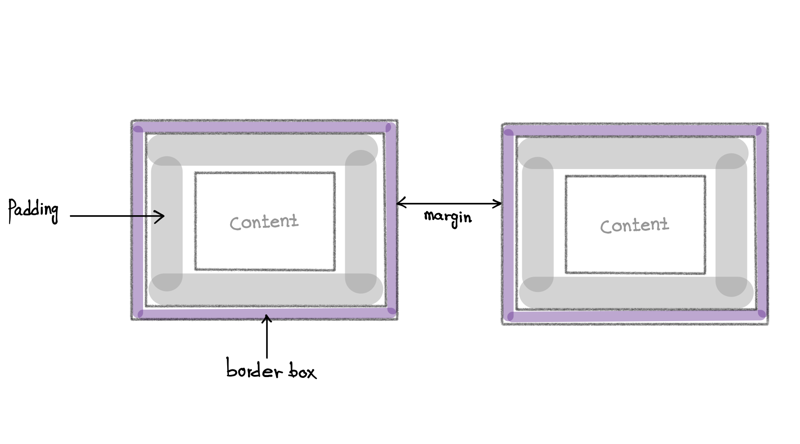

#### Box

Boxes helps web browsers on how to display the elements on the screen.
Each single element is enclosed inside a box. For instance if we consider 
Hello
 as our element, then there is a box around this element which specifies its heights, widths, its distance from other element and so on.

CSS roles are applied to the box of the element.

Every box consist of four element which are content, padding, border, and margin.

<table>
      <tr>
        <th>name</th>
        <th>definition</th>
        <th>css rule</th>
      </tr>
      <tr>
        <td>content</td>
        <td>
          It is the actual content of the element, for instance images, texts It
          has width and height which are known as content height and content
          width
        </td>
          <td>
          element{ width:2px; min-with:1px; max-width:3px; height:4px;
          min-height:2px; max-height:8px; }
        </td>
        </tr>
        <tr>
      </tr>
      <tr>
        <td>padding</td>
        <td>
          It extends the content size, not the actual content, but the distance
          between the content and the border.
        </td>
        <td>
          element{ padding-top:3px; padding-right:5px; padding-bottom:9px;
          padding-left:8px; }
        </td>
      </tr>
      <tr>
        <td>border</td>
        <td>it goes around the padding and content</td>
        <td>element{ border-width:4px}</td>
      </tr>
      <tr>
        <td>margin</td>
        <td>
          It separates an element from its neighboring elements, or it is the
          distance between two elements/td>
        </td>
        <td>
          element{ margin-top:3px; margin-right:4px; margin-bottom:4px;
          margin-left:3px; }
        </td>
      </tr>

<table>
