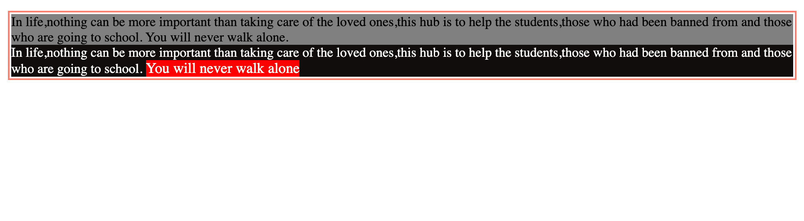

## Position

It determines the position of the elements and how they should flow.

### 1. relative

```css
position: static;
top: 200px;
```

It allows us to move or position the element relative to its normal flow irrespective of its neighboring elements.

The values we can use here are `top, bottom, left, right`.

For instance

```css
.one {
	position: relative;
	top: 200px;
}
```

It means move the element with the class name one `200px` from the top and it does not effect the neighboring elements on the top or on the bottom.

<figure>

<figcaption><p align="ceneter"> Normal flow</p></figcaption>
</figure>

<figure>

<figcaption><p align="ceneter">Adding position relative property to the first element</p></figcaption>
</figure>
