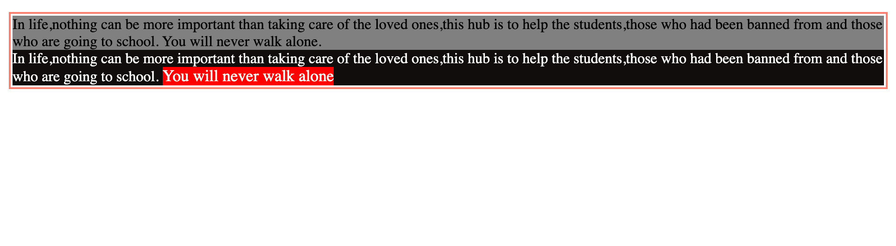
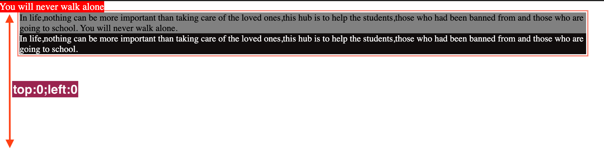

## Position

It determines the position of the elements and how they should flow.

### absolute

```css
.special {
	position: absolute;
	top: 0;
	left: 0;
}
```

It allows us to move or position the element with `position: absolute` value relative to its parent. The parent should have the value of `position: relative` so that we can move the element with `position: absolute` relative to that.
If there is no parent with `position: relative`, then the body will be our parent element and the element will be positioned based on the body.

The values we can use here are `top, bottom, left, right`.

For instance

```css
.one {
	position: relative;
	top: 200px;
}
```

It means move the element with the class name one `200px` from the top and it does not effect the neighboring elements on the top or on the bottom.

```html
<!DOCTYPE html>
<html lang="en">
	<head>
		<meta charset="UTF-8" />
		<meta name="viewport" content="width=device-width, initial-scale=1.0" />
		<link rel="stylesheet" href="style.css" />
		<title>Float</title>
	</head>
	<body>
		<div>
			<p class="one">
				In life,nothing can be more important than taking care of the loved
				ones,this hub is to help the students,those who had been banned from and
				those who are going to school. You will never walk alone.
			</p>
			<p class="two">
				In life,nothing can be more important than taking care of the loved
				ones,this hub is to help the students,those who had been banned from and
				those who are going to school.
				<span class="special">You will never walk alone</span>
			</p>
		</div>
	</body>
</html>
```

In the above snippet, if we consider `span` element with class special, its parents can be `body, div and p with class two`.
We can set its position based on the above parents, not the neighbor one with class `two`.

```css
* {
	padding: 0;
	margin: 0;
	box-sizing: border-box;
}

div {
	padding: 2px;
	margin: 1rem 2rem;
	border: 2px salmon solid;
}

.one {
	background: grey;
	position: relative;
	top: 200;
}
.two {
	background: rgb(17, 13, 13);
	color: white;
}

.special {
	background: red;
	font-size: 1.1rem;
	position: absolute;
	top: 0;
	left: 0;
}
```

<figure>

<figcaption><p align="ceneter"> Normal flow</p></figcaption>
</figure>

<figure>

<figcaption><p align="ceneter">Adding position absolute property to the span element</p></figcaption>
</figure>
