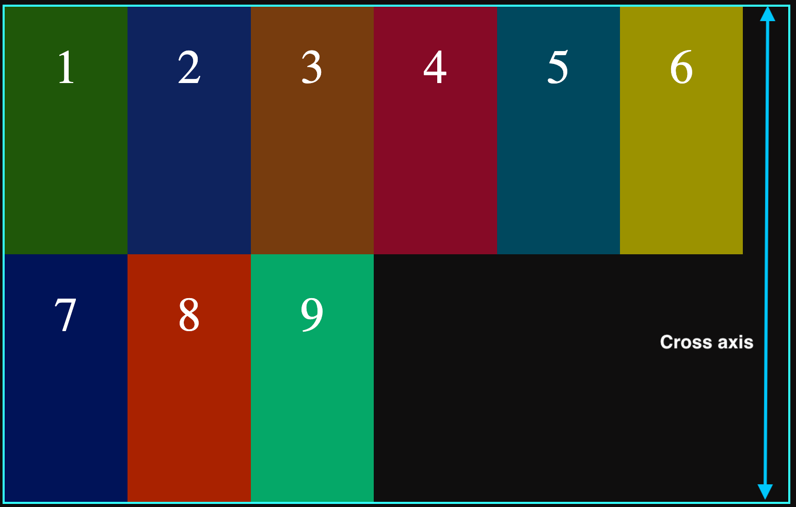
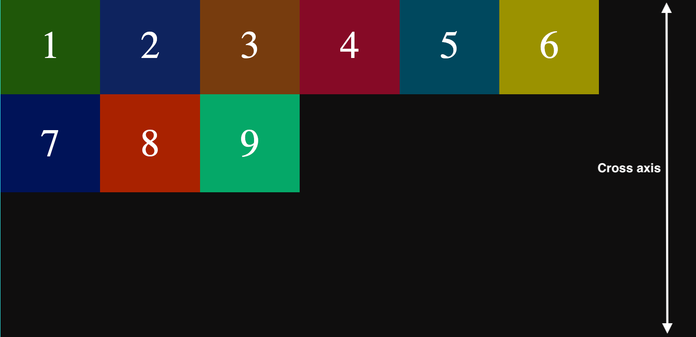
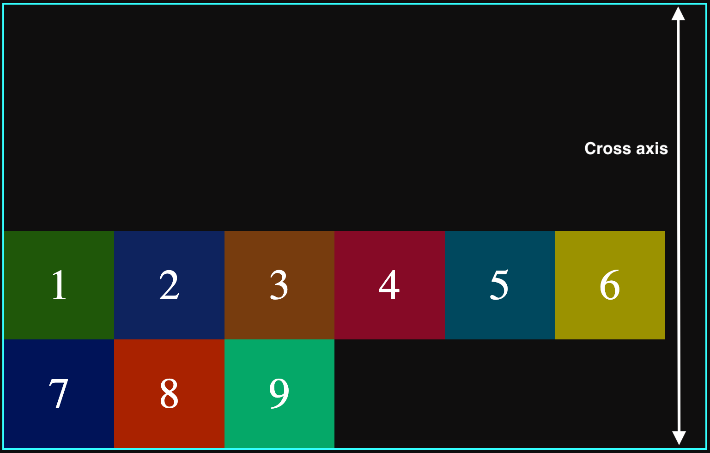
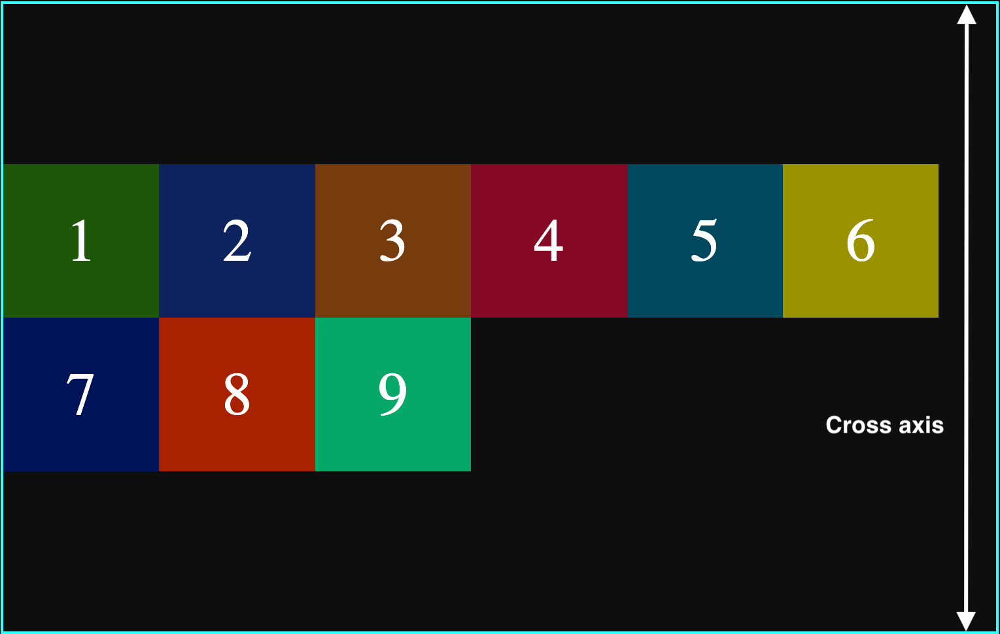
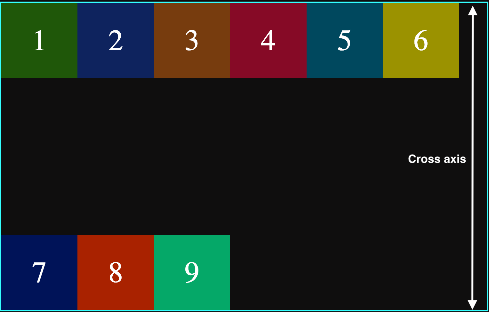
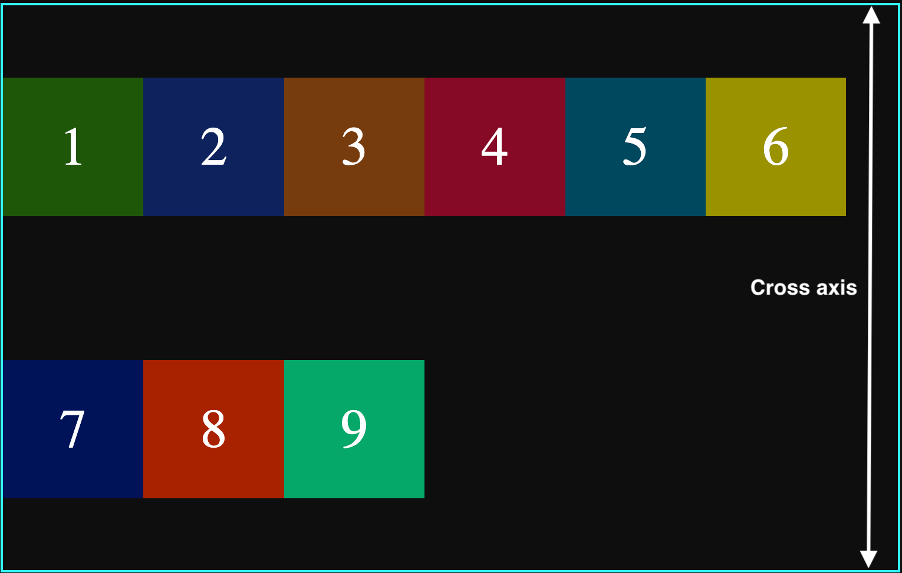
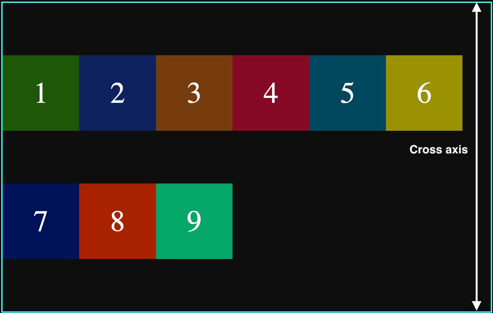

## Align Content:

It adjust the elements along the cross axis(vertical axis), but with one big difference with `align-items`;Here the aligning is done between the elements where as in `align-items`, the aligning was done as a whole.

Using this property, the individual elements are the target to be aligned along the cross axis.

This can have affect only if the flex items are along multiple lines and that can be achieved if the properties set to `flex-wrap:wrap|reverse-wrap`.
In one single line flexible container, this does not have any affect.
Also, for flexible container, some height should be assigned.

Just like `justify-content`, but in vertical direction. These aligning can be performed only if there is leftover spaces in the container.

```css
.container {
	height: 30rem;
	display: flex;
	flex-wrap: wrap;
	align-content: normal;
	align-content: start;
	align-content: end;
	align-content: space-between;
	align-content: space-around;
	align-content: space-evenly;
	align-content: stretch;
	border: 2px rgb(50, 255, 255) solid;
}
```

Following values can be assigned to `align-content`:

`align-content:normal`: Default; The elements position will be placed at their default position.

<figure>

</figure>

`align-content:start`: Items are placed at the start of the cross axis.

<figure>

</figure>

`align-content:end`: Items are placed at the end of cross axis.

<figure>

</figure>

`align-content:center`: Items are placed at the center of cross axis.

<figure>

</figure>

`align-content:space-between`: Items are placed in such a way that the first line is placed at the start and last line is placed at the end of the cross axis.

<figure>

</figure>

`align-content:space-around`: Items are placed in such a way that there is evenly distributed space between each line of the content. For first and last line of items, there is one unit space between the starting line of the items and the border, and between the ending line of the items and the end of the border.

<figure>

</figure>

`align-content:space-evenly`: Items are placed in such a way that the space between each line of the items are evenly distributed and equal.

<figure>

</figure>

`align-content:stretch`: Items are stretched to take the remaining spaces.

<figure>

</figure>
