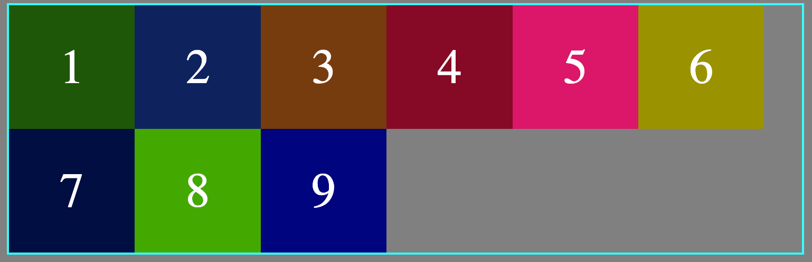
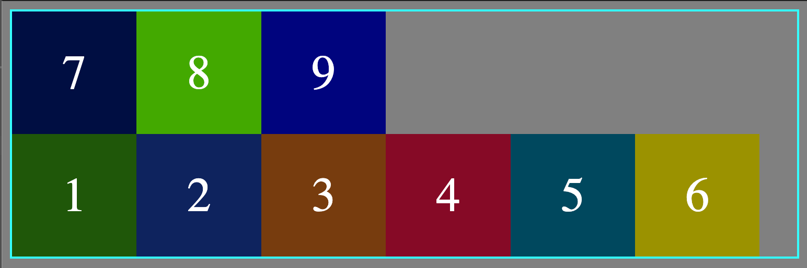

# flex-wrap:

By default flex box items tries to stay and fit in one line, but this property can be changes using different values for `flex-wrap` property.

```css
.container {
	display: flex;
	flex-wrap: wrap | nowrap | wrap-reverse;
}
```

`nowrap` causes overflow which means some of the contents cannot be seen and will move out of the normal flow.

Following values can be assigned to `flex-wrap` property:

-`flex-wrap:wrap`: Wraps the elements across multiple lines after certain point when the items cannot be fit in one line.

  <figure>
  
  </figure>

-`flex-wrap:nowrap`: Default value and fits all the element across main axis, but causes overflow.

  <figure>
  
  </figure>
  
-`flex-wrap:wrap-reverse`: Wraps the element from bottom to top.
  <figure>
  
  </figure>

```html
<body>
	<!-- parent -->
	<div class="container">
		<!-- Children -->
		<div class="box box-1">1</div>
		<div class="box box-2">2</div>
		<div class="box box-3">3</div>
		<div class="box box-4">4</div>
		<div class="box box-5">5</div>
		<div class="box box-6">6</div>
		<div class="box box-7">7</div>
		<div class="box box-8">8</div>
		<div class="box box-9">9</div>
	</div>
</body>
```

```css
body {
	background-color: grey;
	border: 2px rgb(50, 255, 255) solid;
}

.container {
	display: flex;
	/* create a new line if the contents dose not fit */
	flex-wrap: wrap-reverse;
}
.box {
	text-align: center;
	font-size: 2.9rem;
	padding: 2rem 3rem;
	color: white;
}
```
