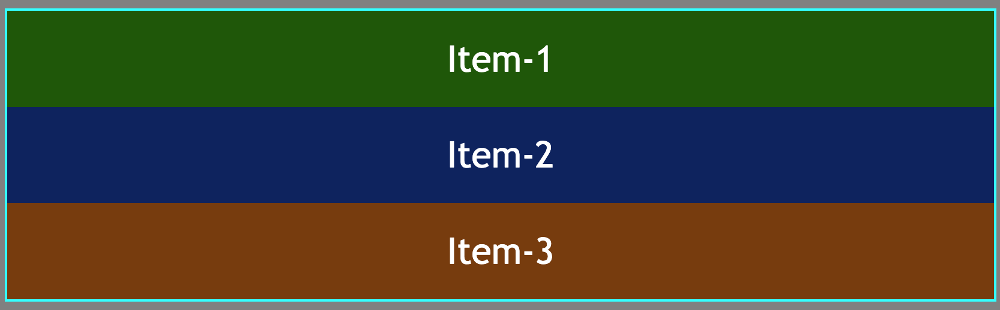
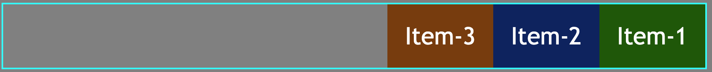
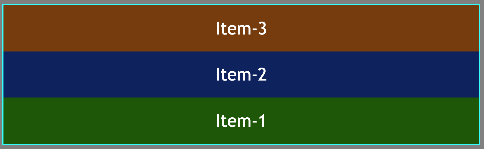

# flex-direction

This defines the main axis, in another words the way children are going to aligned, either horizontally or vertically.
If it is not mentioned, default value is horizontal from left to right:

```html
<body>
	<!-- Parent -->
	<div class="container">
		<!-- Children -->
		<div class="box box-1">item-1</div>
		<div class="box box-2">item-2</div>
		<div class="box box-3">item-3</div>
	</div>
</body>
```

```css
.container {
	display: flex;
	/* flex-direction: row-reverse; */
	/* flex-direction: column-reverse; */
	/* flex-direction: row; */
}
.box {
	text-align: center;
	font-size: 1.9rem;
	padding: 1.4rem 1.4rem;
	color: white;
	text-transform: capitalize;
	font-family: "Courier New", Courier, monospace;
	font-family: "Trebuchet MS", "Lucida Sans Unicode", "Lucida Grande",
		"Lucida Sans", Arial, sans-serif;
}
```

Following values can be assigned to `flex-direction` property:

- `flex-direction:row`: default; main axis is horizontal axis from left to right along the main.

  <figure>
  
  </figure>

- `flex-direction:column`: main axis is cross axis from top to bottom which means the elements will be from top to bottom.
  <figure>
  
  </figure>

- `flex-direction:row-reverse`: elements are aligned from right to left.
  <figure>
  
  </figure>

- `flex-direction:column-reverse`: elements ara aligned from bottom to top.
  <figure>
  
  </figure>
