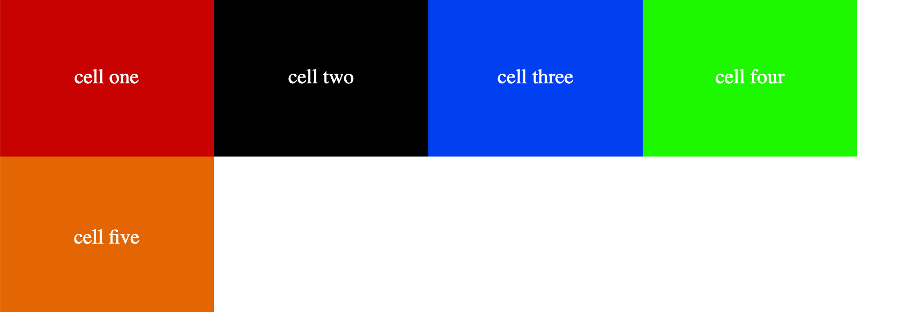
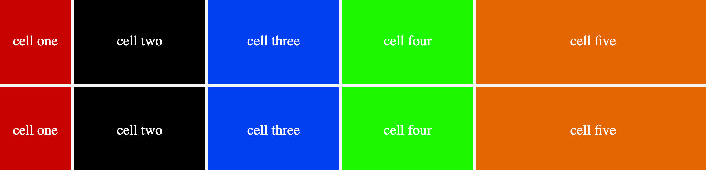

## Grid Explicit Properties:

### `grid-template-rows:value1 value2 value3 .... `

It allows us to create rows and columns using `grid-template-rows` and `grid-template-columns`.

It creates a row track for each value specified in `grid-template-rows` .
For instance, value1 means for value, the height of the row should be as much as is specified in value1.
These values can be in `%, em, px, rem, etc.`

Lets say we are having five `div` elements and we want the first two row to have `50px, 150px` height, each of them respectively.

```css
.container{
    display: grid,
    grid-template-row: 50px 150px
}

```

The first two rows will have the height specified earlier, but remaining ones will get what their values are.


<p align="center">Explicit grid layout rows applied for all</p>

We can have specific height for all of them as well, lets say we want `55px 20px 40px 70px 40px;` for each of the rows respectively, just add them.

```css
.container{
    display: grid,
    grid-template-row: 55px 20px 40px 70px 40px;
}

```


<p align="center">Explicit grid layout rows applied for all</p>

## Fraction(fr):

It represents fraction of remaining space when combined with other units.

For instance if `grid-template-row: 20px 30px 40x 1fr 1fr;`, it means that first three rows will take as much space as its mentioned, but remaining space will be divide to two last rows, one fraction each.

Among all, fraction is the most widely used unit here when we want to create responsive layouts.

#### `grid-template-columns:value1 value2 value3 .... `

It creates a column track for each value specified in `grid-template-columns` .

It has the same properties as `grid-template-rows`, but it divides the layout into vertical sections instead of rows.

For instance, when we are have `grid-template-columns:150px, 150px` it divides our container into two section vertically, each having `50px` and `150px` width. all elements in the first column will be having width of `50px` and in the second column, width of `150px`.

!Important: Height of each element will be decided by `grid-template-rows` properties.
For instance if we have `grid-template-rows: 170px 200px 100px;`, it means that we want three rows in our layout, first one is having height of `170px`, second one is having height of `200px`, and the third one is having height of `100px`.

<figure>

<p>grid columns property</p>
</figure>

### repeat:

It is a function that allows us to create columns and rows easily with specified values.
This is useful when we want to crete many rows or columns that are having the same values.

Lets say, we want to create a layout that has two rows columns, each 150px and four columns each 200px.

```css
.container {
	display: grid;
	grid-template-rows: repeat(2, 150px);
	grid-template-columns: repeat(4, 200px);
}
```

<figure> 

<p>grid repeat function</p>
</figure>

!Important: If there is mismatch between number of elements and the number of cols/rows we specified in `grid-template-columns/rows` property, based on css rule, the last one will be followed. For instance in the above example if we specify to have 100 rows, but there is only 5 elements, it will not create 100 rows, It will follow what is mentioned in the next line which is four columns.

Now, lets say we are having 10 items and we want to first column to have width of `100px` and the second column consist of three cells each having a width of `180px` and the last column to be free, which means take the remaining space.

How would you divide it?

```css
.container {
	display: grid;
	grid-template-rows: repeat(2, 120px);
	grid-template-columns: 100px repeat(3, 180px) 1fr;
}
```

<figure> 

<figcaption><p align="center">grid repeat function</p></figcaption>

</figure>
