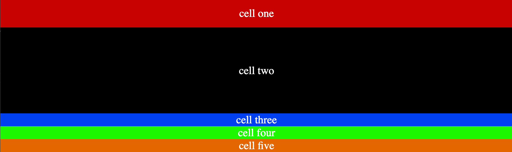
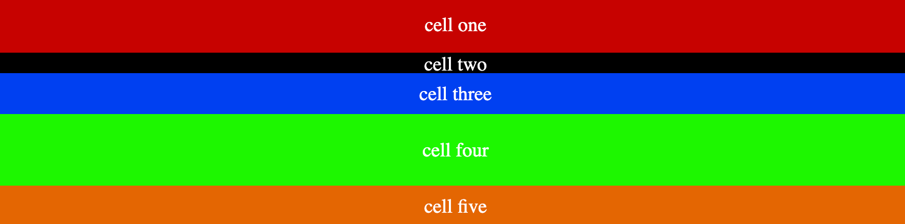

## Grid Explicit Properties:

It allows us to create columns and rows using `grid-template-columns` and `grid-template-rows`.

#### `grid-template-columns:value1 value2 value3 .... `

It creates a row track for each value specified in `grid-template-columns` .
For instance, value1 means for value, the height of the row should be as much as is specified in value1.
These values can be in `%, em, px, rem, etc.`

Lets say we are having five `div` elements and we want the first two row to have `50px, 150px` height, each of them respectively.

```css
.container{
    display: grid,
    grid-template-row: 50px 150px
}

```

The first two rows will have the height specified earlier, but remaining ones will get what their values are.

<figure>

<figcaption>Explicit grid layout</figcaption>
</figure>

```css
.container{
    display: grid,
    grid-template-row: 55px 20px 40px 70px 40px;
}

```

We can have specific height for all of them as well, lets say we want `55px 20px 40px 70px 40px;` for each of the rows respectively, just add them.

<figure>

 
<p align="center">Explicit grid layout rows applied for all</p>
</figure>
