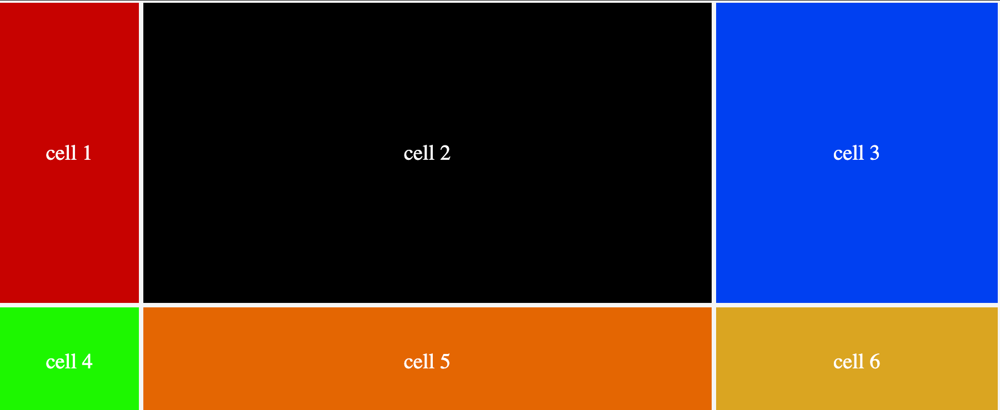
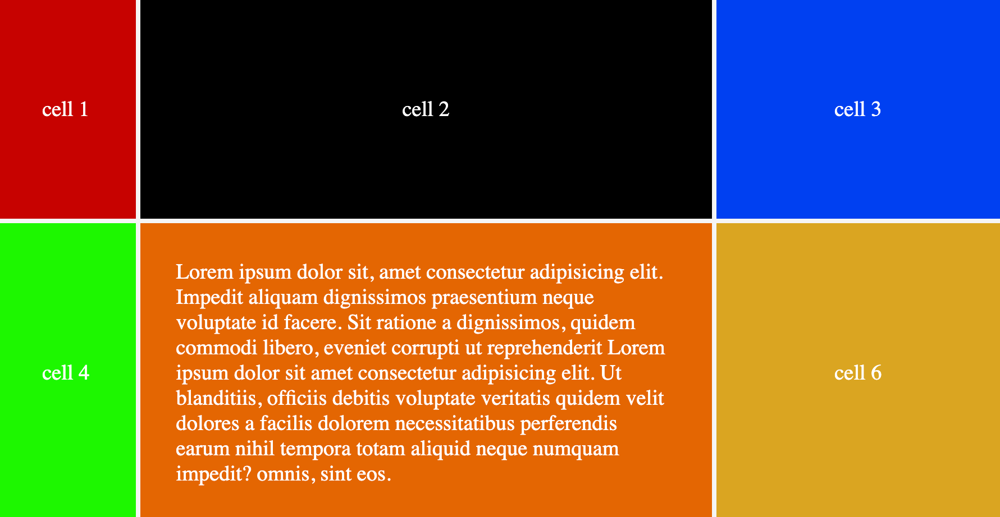

## minmax(min-value, max-value):

A function that determines minimum or maximum size of an element.
It takes two arguments, the first one is the minimum width or height an element can take, and the second value is the maximum width or height an element can take from its parents.

`auto`: When the any of the values is assigned to auto, it allows the element to grow or shrink based on the size of the content.
`fr`: It allows the rows/columns to take remaining spaces after the fixed sizes.
`%`: It takes a percentage of remaining spaces from container.

Lets Explore with some examples:

```css
.container {
	display: grid;
	min-height: 50vh;
	grid-template-rows: minmax(200px, auto);
	grid-template-columns: 0.25fr minmax(100px, 1fr) 0.5fr;
}
```

`grid-template-rows: minmax(200px, auto);`: 200px shows the minimum height an it means no matter what, the height should not be less than 200px and the auto is the maximum height which means take as much as height you want based on your content.

`grid-template-columns: 0.25fr minmax(100px, 50%) 0.5fr;`: It specifies there is going to be 3 columns, the first column will take 0.25 fraction of available space, the second column will occupy at least `200px` of the container and can go up to `50%` of container, but not less than `200px` and the last column will take `0.5` fraction of the available space.

<figure> 

<figcaption><p align="center">grid mimax function</p></figcaption>
</figure>

In the following image, it can be observed that the second row stretched because of its content size and the value we added for max-value in minmax() function was `auto`.

<figure> 

<figcaption><p align="center">grid minmax function with content in second row.</p></figcaption>
</figure>
