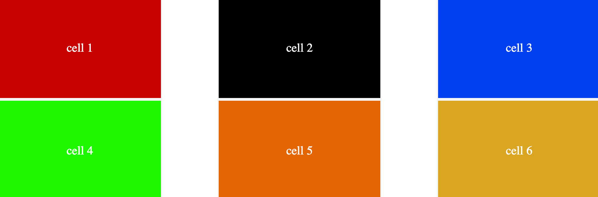
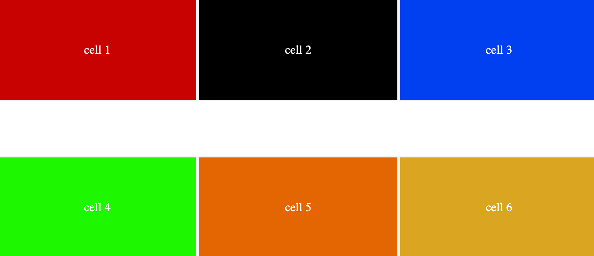
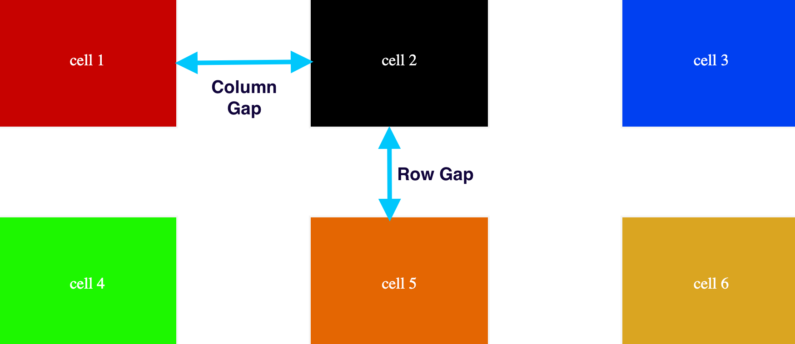
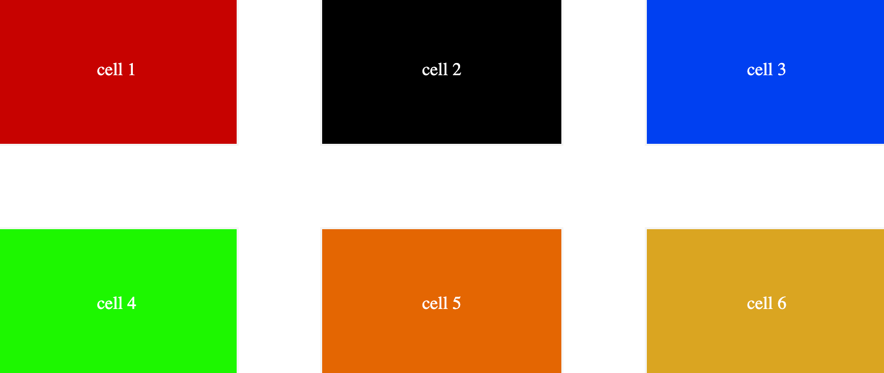

## Gutter:

the gap between columns and rows are known as gutters.
Using two properties `column-gap` and `row-gap`, the gap between columns and rows can be created respectively.

### column-gap:

It creates a horizontal distance between the elements. these distance will not be applied to the edges.

```css
.container {
	display: grid;
	grid-template-rows: 150px 150px;
	grid-template-columns: repeat(3, 1fr);
	column-gap: 5rem;
}
```

<figure> 

<figcaption><p align="center">grid gutters</p></figcaption>
</figure>

### row-gap:

It creates vertical gap between the elements, or in another words, between the rows inside a container.

```css
.container {
	display: grid;
	grid-template-rows: 150px 150px;
	grid-template-columns: repeat(3, 1fr);
	row-gap: 5rem;
}
```

<figure> 

<figcaption><p align="center">grid gutters</p></figcaption>
</figure>

### `row-gap, column-gap`:

It creates vertical gap between the elements, or in another words, between the rows inside a container.

```css
.container {
	display: grid;
	grid-template-rows: 150px 150px;
	grid-template-columns: repeat(3, 1fr);
	row-gap: 6rem;
	column-gap: 9rem;
}
```

<figure> 

<figcaption><p align="center">grid gutters</p></figcaption>
</figure>

### gap:

A shorthand that is doing the same thing as `column` and `row-gap` does, combined!

It can be used in two ways:

1. ### `gap: row-gap column-gap`:

Both of the gaps can be added for a single container with different elements.

```css
.container {
	display: grid;
	grid-template-rows: 150px 150px;
	grid-template-columns: repeat(3, 1fr);
	gap: 4rem 4rem;
}
```

<figure> 

<figcaption><p align="center">grid gutters</p></figcaption>
</figure>

2. ### `gap: row-column-gap`:

Just one value, will be sufficient. It is used when we want same gap between rows and columns.

```css
.container {
	display: grid;
	grid-template-rows: 150px 150px;
	grid-template-columns: repeat(3, 1fr);
	gap: 4rem;
}
```

<figure> 

<figcaption><p align="center">grid gutters</p></figcaption>
</figure>
