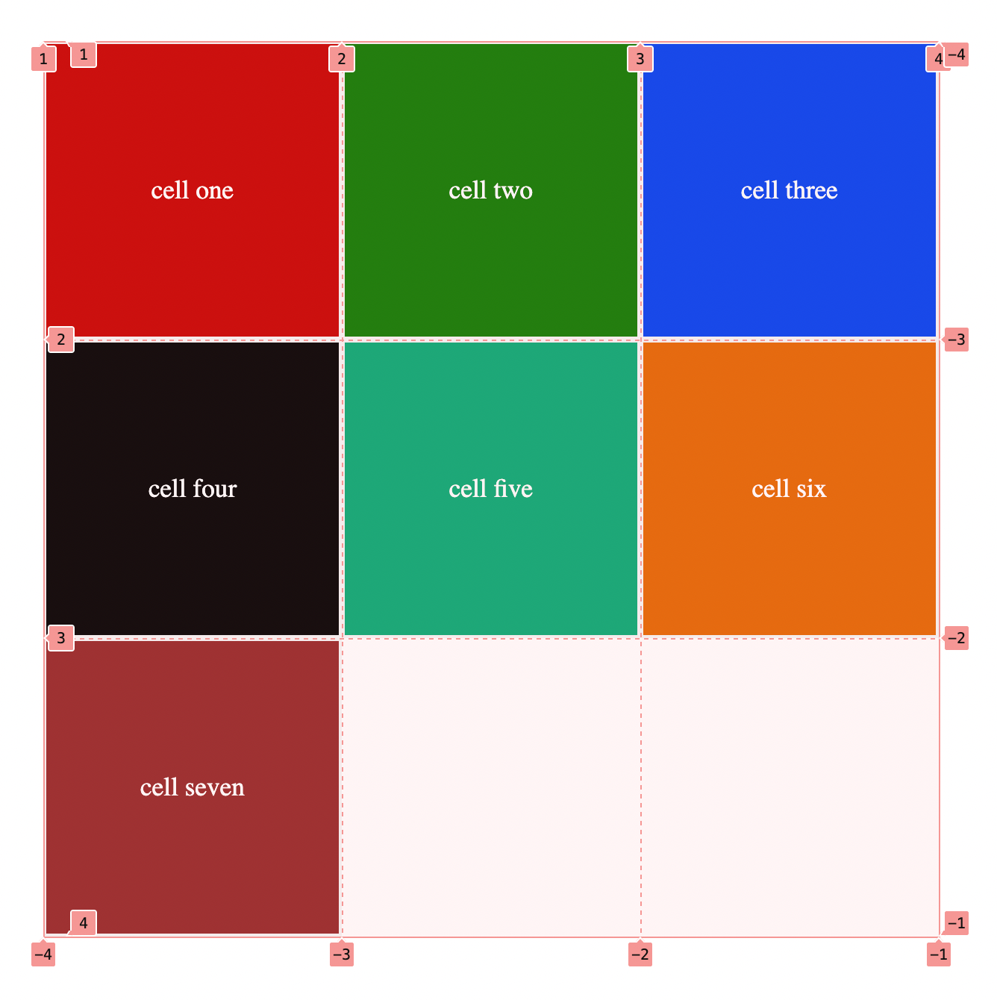
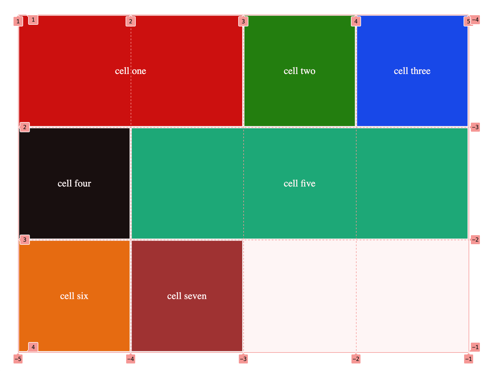
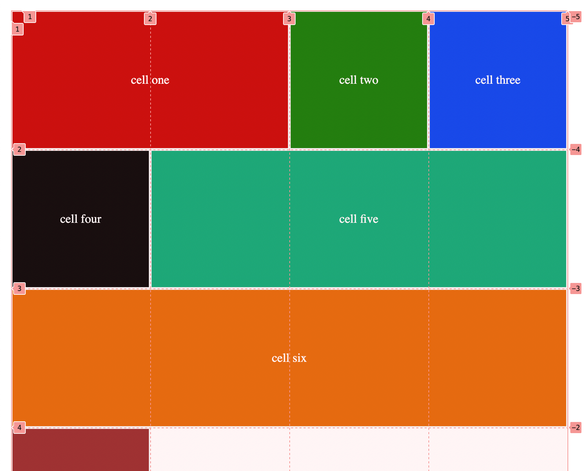
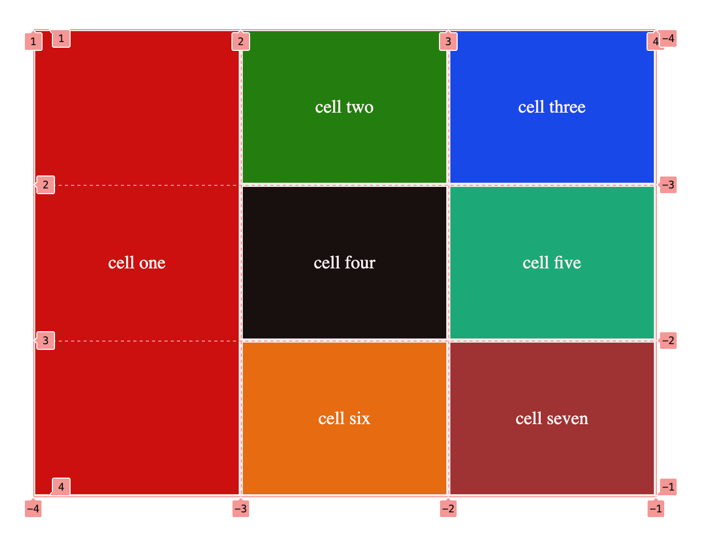

## Grid Lines:

Behind the scene, each row and columns have their number..
For instance, the left and top most corner column/row(first columns) starts with number 1, moving to the right, end of that column is marked with number 2.
Column two starts with number 3 and ends with number 4.
Column three starts with number 4 and ends with number 5.

Same goes with rows, from top to bottom line numbers increases.
There is negative number as well which starts with number -1 from right most, moving towards the left, it decreases by one number.

By using `developer` tools in browser of your choice, when clicking on the container these numbers can be seen clearly.

Use `command+shift+c` in macos, or `control+shift+c` in windows to open developer tools.

#### What are the use of these lines?

We can specify from which number to which number a particular children(cell) can span.

<figure>

<figcaption>
<p align="center">grid lines using developer tools.</p>
</figcaption>
</figure>

Lets say, we want the first cell to span from first line to third line, which means it takes two columns.

The fifth cell to start from second column and go up to 4th column.

## grid-column-start/end

We can use `grid-column-start` and `grid-col-end` to specify the start and end of a cell.
The value assigned to these properties represents the line numbers.

```css
.cell-1 {
	background: rgb(199, 0, 0);
	grid-column-start: 1;
	grid-column-end: 3;
}

.cell-5 {
	background-color: rgb(0, 170, 116);
	grid-column-start: 2;
	grid-column-end: 5;
}
```

<figure>

<figcaption>
<p align="center">grid lines using developer tools</p>
</figcaption>
</figure>

#### Question:

Now we want a column to start from a specif line and goes up to the end, How to do this if we do not know number of grid lines or columns?

As mentioned earlier, the grid lines from the end starts with negative one, so we can assign to the `grid-col-end` value -1.

For instance if we want the cell-6 to span through out the rows.

```css
.cell-1 {
	background: rgb(199, 0, 0);
	grid-column-start: 1;
	grid-column-end: 3;
}

.cell-7 {
	background: rgb(199, 0, 0);
	grid-column-start: 1;
	grid-column-end: -1;
}
```

<figure>

<figcaption>
<p align="center">grid lines using developer tools.</p>
</figcaption>
</figure>

## grid-row-start/end:

All properties same as `grid-column-start/end`, with the difference that it moves in vertical track.

For instance we want the first cell to take the the space of first column and whole rows in that column.

```css
.cell-7 {
	background: rgb(199, 0, 0);
	grid-row-start: 1;
	grid-row-end: -1;
}
```

<figure>

<figcaption>
<p align="center">grid lines using developer tools.</p>
</figcaption>
</figure>
