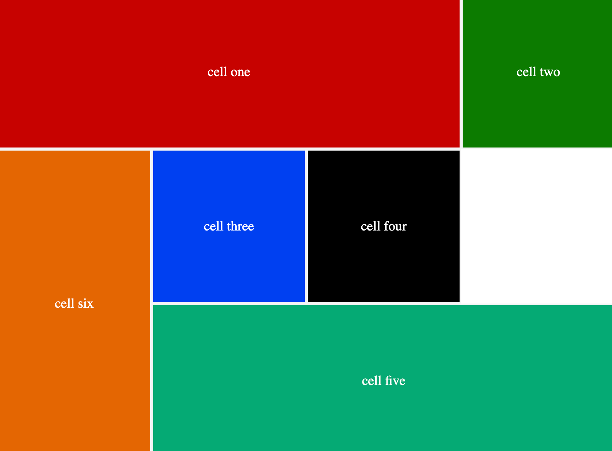

## Grid Naming:

The names can be added to each column/row start and end so that when adding the names, instead of conventional names like 1,2 and so, we can use the names we added there.

```csc
.container {
	display: grid;
	grid-template-columns: [start] 200px [col-1-end] 200px [col-2-end] 200px [col-3-end] 200px[end];
	grid-template-rows: [start] 200px [row-1-end] 200px [row-2-end] 200px [row-3-end] 200px[end];
}


.cell {
	color: white;
	font-size: 1.1rem;
	display: grid;
	place-items: center;
	border: 2px solid rgb(245, 245, 245);
}

.cell-1 {
	background: rgb(199, 0, 0);
	grid-column: start/col-3-end;
}

.cell-2 {
	background: rgb(14, 123, 0);
}

.cell-3 {
	background: rgb(0, 64, 241);
}

.cell-4 {
	background: rgb(0, 0, 0);
}

.cell-5 {
	background-color: rgb(0, 170, 116);
	grid-column-start: 2;
	grid-column-end: 5;
}

.cell-6 {
	background: rgb(227, 102, 0);
	grid-row: row-1-end/row-3-end;
}

```

Here at the start and end of each column, we have added a name.
For instance, in `grid-template-columns`, instead of 1, `start` will be used, instead of `2`, `col-1-end` will be used an so on.

<figure>

<figcaption>
<p align="center">grid naming in a container</p>
</figcaption>
</figure>
