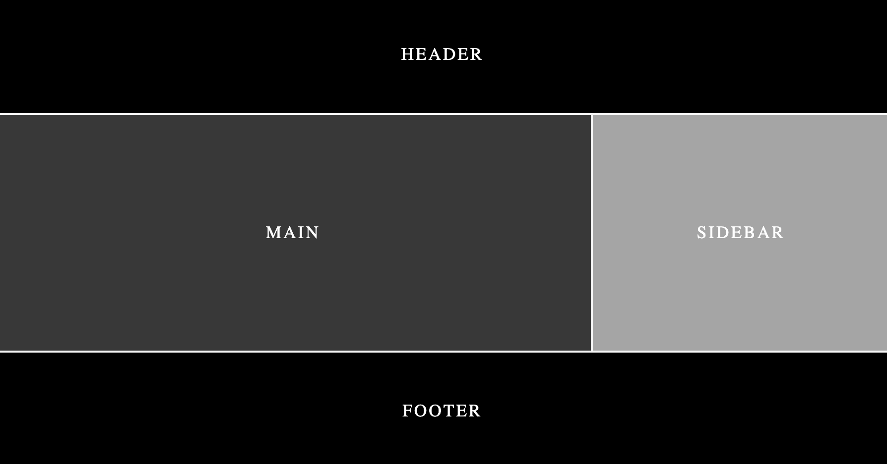

## Positioning Items Using Grid Areas

Just like grid naming, here also each cell can be positioned in different rows and columns.

Two step procedure:

- Add an area name to the child of the container.
- Add those names in the container to the `grid-template-areas` property.

### grid-template-areas:

It creates a grid template by using the names of the grid areas which are mentioned with grid-area property for each child.

It creates a layout for us by giving the freedom how much each cell should span across the template.

Note: Number of names should be equal across all rows in the template.

```css
.container {
	grid-template-area:
		"name1 name2 name3"
		"name1 name2 name4"
		"name4 name4 name4"
		"name2 name2 name3";
}

.cell1 {
	grid-area: name1;
}
.cell2 {
	grid-area: name2;
}
.cell3 {
	grid-area: name3;
}
.cell4 {
	grid-area: name4;
}
```

In the above snippet, each line represents a row and each name represents a column. The names should be wrapped by "".

Based on above values, the first row will be filled with `cell1`, the second row will have one column from each cell, the third row will be filled with `cell4` and so on.

When we are having four rows and three columns, the `grid-template-rows` and `grid-template-columns` also should be arranged based on that.

### grid-area:

Gives an item a name so that it can be referenced by a template created with the grid-template-areas property.
gird-area = grid-row-start + grid-column-start + grid-row-end + grid-column-end.

```css
* {
	margin: 0;
	padding: 0;
	box-sizing: border-box;
}

.container {
	display: grid;
	grid-template-rows: repeat(4, 120px);
	grid-template-columns: repeat(3, 1fr);
	grid-template-areas:
		"header header header"
		"main main sidebar"
		"main main  sidebar"
		"footer footer footer";
}

.cell {
	color: white;
	font-size: 1.1rem;
	display: grid;
	place-items: center;
	letter-spacing: 2px;
	border: 1px solid rgb(245, 245, 245);
}

.cell-1 {
	background: rgb(0, 0, 0);
	grid-area: header;
}

.cell-2 {
	background: rgb(56, 56, 56);
	grid-area: main;
}

.cell-3 {
	background: rgb(165, 165, 165);
	grid-area: sidebar;
}

.cell-4 {
	background: rgb(0, 0, 0);
	grid-area: footer;
}
```

<figure>

</figure>

## Note:

Every element inside a container has the order of 0 and that is how they are displayed based on normal flow.
If we want place an element after all elements positions, change the order of that element to a positive number.

```css
.cell-4 {
	order: 3;
}
```

Now, `cell-4` will appear after all other elements.

To have an element to appear before every element, add a negative value to its order.

```css
.cell-4 {
	order: -1;
}
```

Now, `cell-4` will appear before every elements.
