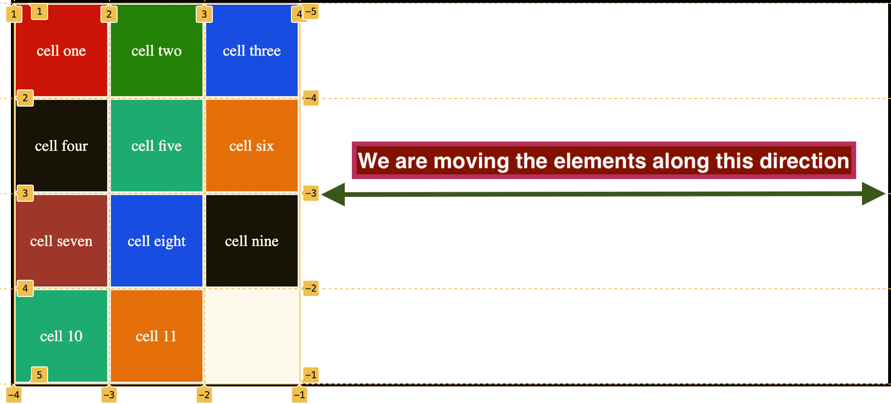

## Justify-content

It the container children or grid tracks along the horizontal or column axis.

Note that all movements are done between or for columns, which means that the elements are moving either to the left or right.

By default, it uses `justify-content: start`

Lets study some of its properties:

### 1. start:

It is the property that is by default, all columns are aligned at the beginning.

```css
.container {
	display: grid;
	grid-template-columns: repeat(3, 100px);
	grid-template-rows: repeat(4, 100px);
	min-height: 50vh;
	max-width: 55vw;
	justify-content: space-around;
	border: 3px solid rgb(3, 1, 0);
}
```

<figure>

<figcaption><p align="center">justify content property with default value</p><figcaption>
</figure>

### 2. end

It pushes all grid tracks along horizontal axis to the right most side of the container.

```css
.container {
	display: grid;
	justify-content: end;
	grid-template-columns: repeat(3, 100px);
	grid-template-rows: repeat(4, 100px);
	min-height: 50vh;
	max-width: 55vw;
	border: 3px solid rgb(3, 1, 0);
}
```

<figure>

<figcaption><p align="center">justify content property with default value</p><figcaption>
</figure>

### 3. center:

It aligns all columns to the center of the container along horizontal axis.

### 4. space-around:

Container's space is evenly distributed between the columns and remaining space is distributed between the border, starting, and ending column.

### 5. space-between:

All the container's space is evenly distributed between the columns.

### 5. space-evenly:

Container's space is evenly distributed between the columns and the starting and ending borders.

### Note:

In order to work with this property all the units should be absolute like `%, px, rem, em`, if we use responsive units like `auto, fr`, the part which has these units will take the rest of the space and this property does not work.
