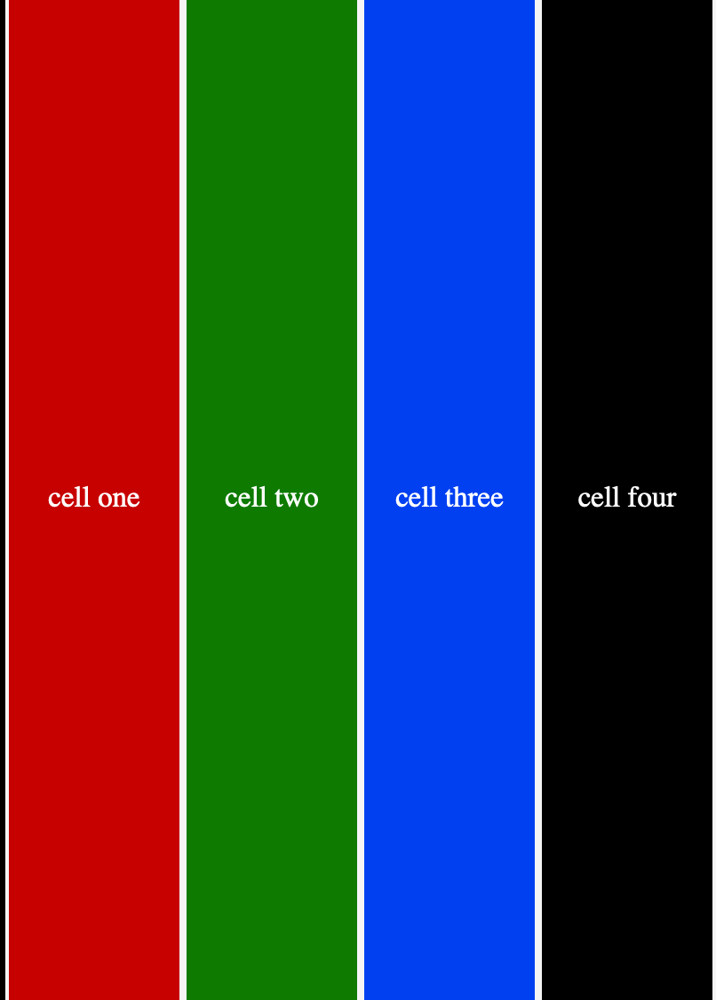
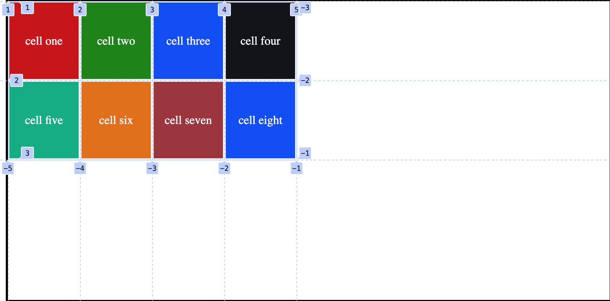
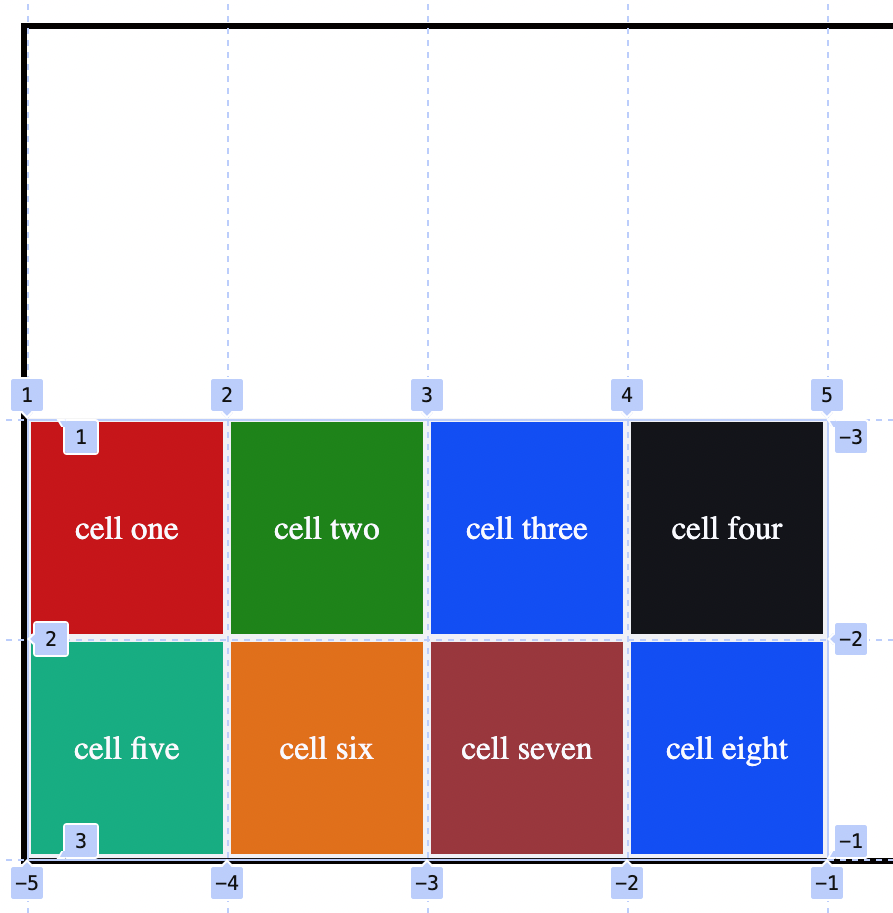
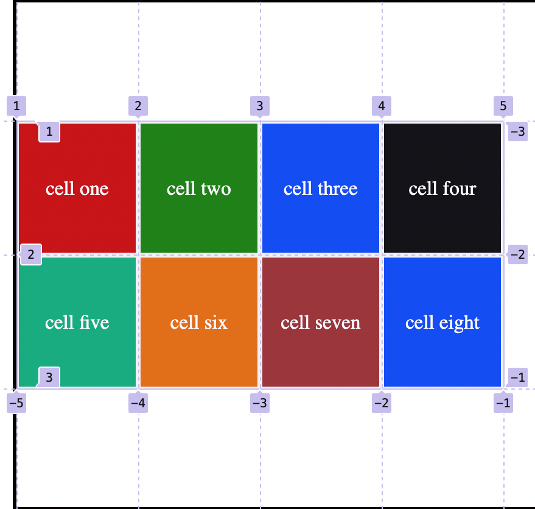
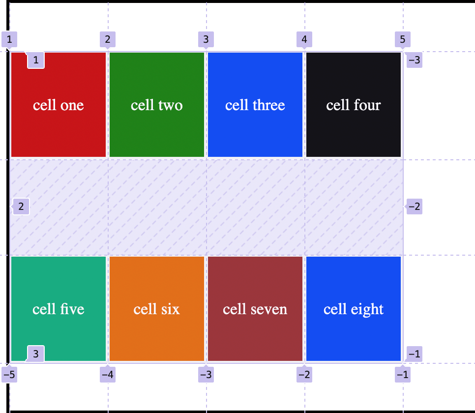
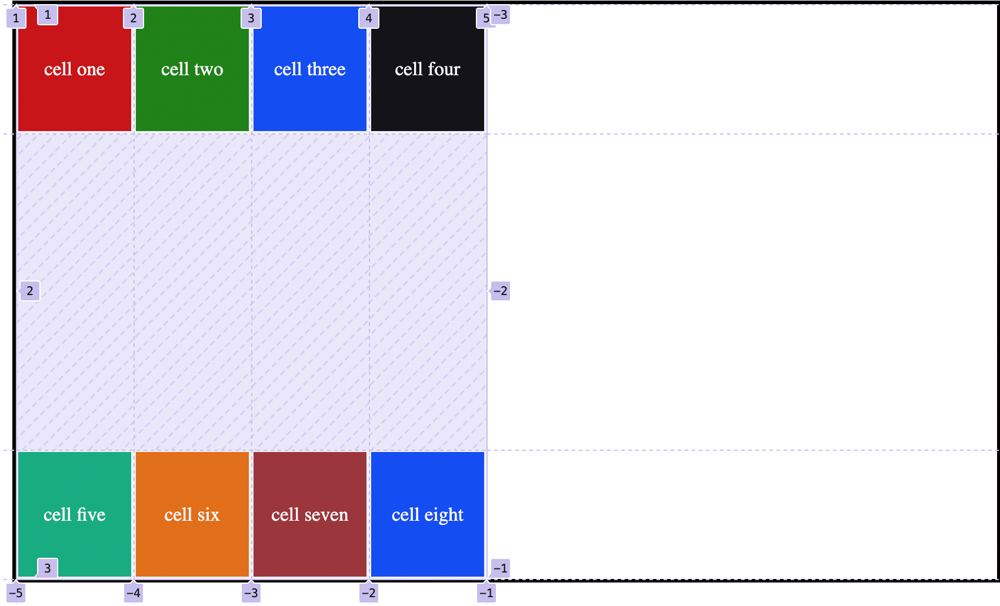
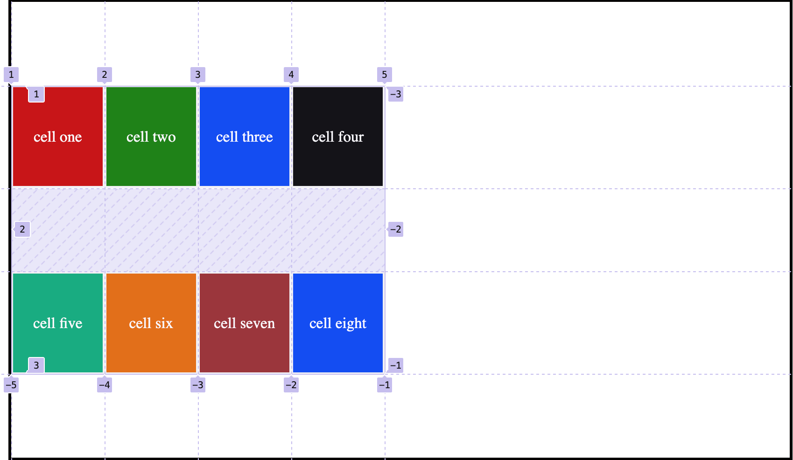

## align-content:

It moves container's element along vertical or column directions and the alignment is done within the container.

The movement is vertical, either to top or bottom of the container.

### possible values it can take:

```css
.container {
	align-content: start | end | center | stretch | space-around | space-between |
		space-evenly;
}
```

## Note:

In order to work with this property `min-height` value should be added to container.

### 1. stretch:

It is the property that is by default, all columns are stretched to take the full height.

```css
.container {
	display: grid;
	align-content: stretch;
	grid-template-columns: repeat(4, 100px);
	min-height: 100vh;
	max-width: 55vw;
	border: 3px solid rgb(3, 1, 0);
}
```

<figure>

<figcaption><p align="center">align content property with default value</p><figcaption>
</figure>

### 2. start:

All items are placed at the start edge of the container from the top.

```css
.container {
	align-content: start;
}
```

<figure>

<figcaption><p align="center">align content property with start value</p><figcaption>
</figure>

### 3. end

It pushes all grid tracks along column or vertical axis to the bottom most of the container.

```css
.container {
	align-content: end;
}
```

<figure>

<figcaption><p align="center">align content property with start value</p><figcaption>
</figure>

### 4. center:

It aligns all items vertically at the center.

```css
.container {
	display: grid;
	align-content: center;
	grid-template-columns: repeat(3, 100px);
	grid-template-rows: repeat(4, 100px);
	min-height: 50vh;
	max-width: 55vw;
	border: 3px solid rgb(3, 1, 0);
}
```

<figure>

<figcaption><p align="center">align content property with center value</p><figcaption>
</figure>

### 5. space-around:

It places even number of spaces between the rows in vertical direction and remaining space which is equal to the space between two rows will go half,half to the top edge and bottom edge between the edges and the rows.

```css
.container {
	display: grid;
	align-content: space-around;
	grid-template-columns: repeat(3, 100px);
	grid-template-rows: repeat(4, 100px);
	min-height: 50vh;
	max-width: 55vw;
	border: 3px solid rgb(3, 1, 0);
}
```

<figure>

<figcaption><p align="center">align content property with space-around value</p><figcaption>
</figure>

### 6. space-between:

It places even number of spaces between the rows in vertical direction and there is no space left to be placed between edges and the rows.

```css
.container {
	display: grid;
	align-content: space-between;
	grid-template-columns: repeat(3, 100px);
	grid-template-rows: repeat(4, 100px);
	min-height: 50vh;
	max-width: 55vw;
	border: 3px solid rgb(3, 1, 0);
}
```

<figure>

<figcaption><p align="center">align content property with space-between value</p><figcaption>
</figure>

### 7. space-evenly:

It places even number of spaces between the rows in vertical direction, and there is an even space between the rows and far top and bottom edges as well.

```css
.container {
	display: grid;
	align-content: space-evenly;
	grid-template-columns: repeat(3, 100px);
	grid-template-rows: repeat(4, 100px);
	min-height: 50vh;
	max-width: 55vw;
	border: 3px solid rgb(3, 1, 0);
}
```

<figure>

<figcaption><p align="center">align content property with space-evenly value</p><figcaption>
</figure>
