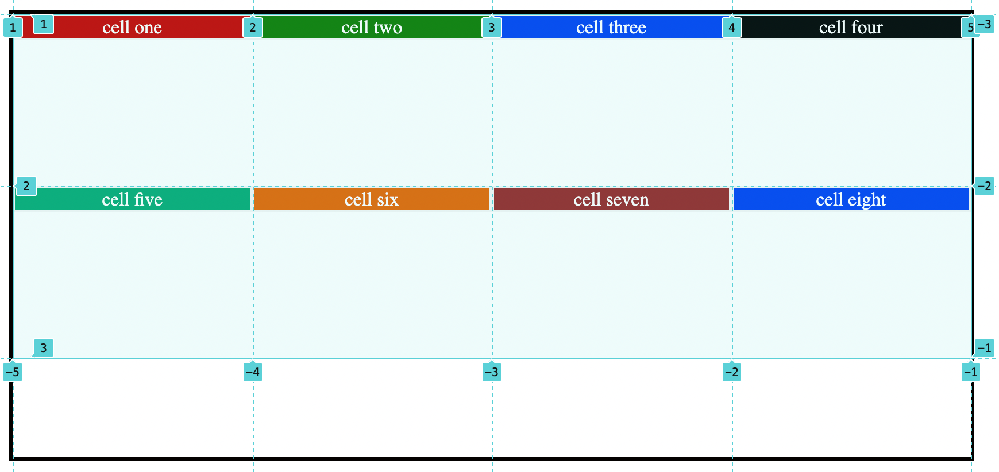

# align-items:

It moves container's elements items along vertical or column directions and the alignment is done within each cell.

The movement is vertical, either to top or bottom of the cell.

### possible values it can take

```css
.container {
	align-items: start | end | center | stretch | baseline;
}
```

## Note:

In order to work with this property `min-height` value should be added to container.

### 1. stretch:

It fills the whole height of the cell.

```css
.container {
	display: grid;
	align-items: stretch;
	grid-template-columns: repeat(4, 100px);
	min-height: 100vh;
	max-width: 55vw;
	border: 3px solid rgb(3, 1, 0);
}
```

<figure>

<figcaption><p align="center">align items property with default value</p><figcaption>
</figure>

From the image it can be observed that the content is moving on vertical direction inside the cell.

### 2. start:

Aligns content to the start edge of their cell.

```css
.container {
	align-items: start;
}
```

<figure>

<figcaption><p align="center">align items property with start value</p><figcaption>
</figure>

It can be observed the content of the cell is at the starting edge of the cell.

### 3. end

Aligns content to the end edge of their cell.

```css
.container {
	align-items: end;
}
```

<figure>

<figcaption><p align="center">align items property with start value</p><figcaption>
</figure>

### 4. center:

Aligns content to the center of their cell.

```css
.container {
	align-items: center;
}
```

<figure>

<figcaption><p align="center">align items property with center value</p><figcaption>
</figure>

### 4. baseline:

It moves the content based on the baseline of the contents.

```css
.container {
	display: grid;
	align-items: baseline;
}
```

<figure>

<figcaption><p align="center">align items property with baseline value</p><figcaption>
</figure>
