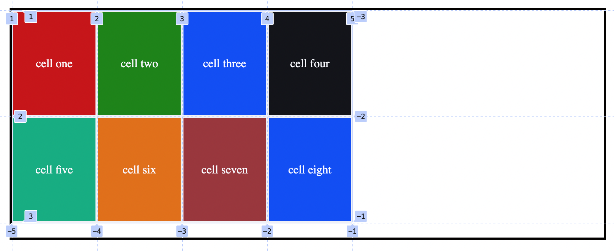
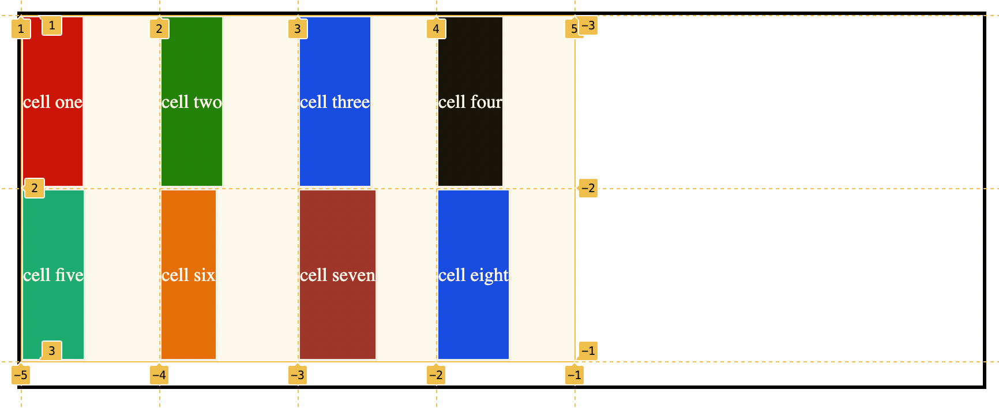
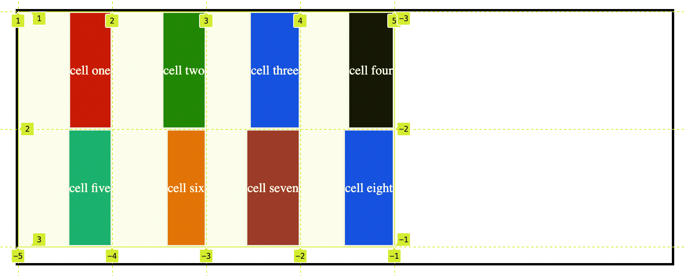
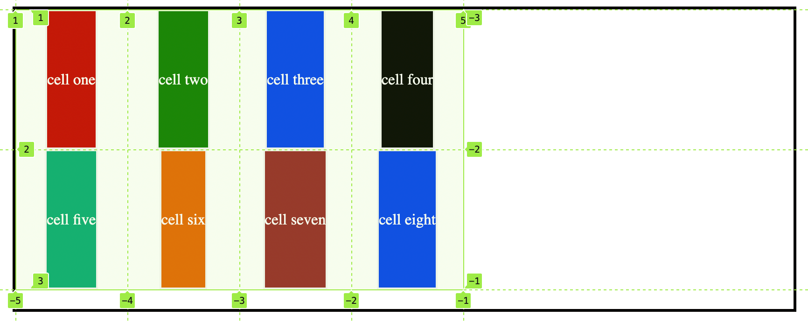

## justify-items:

It moves container's elements items along horizontal or row directions and the alignment is done within the each cell.

The movement is horizontal, either to the left or to the right within a cell.

### possible values it can take:

```css
.container {
	justify-items: start | end | center | stretch | baseline;
}
```

### 1. stretch:

It fills the whole width of the cell and it is the default value as well.

```css
.container {
	display: grid;
	margin: 1rem 0rem 2rem 2rem;
	grid-template-columns: repeat(4, 120px);
	grid-template-rows: repeat(2, 150px);
	justify-items: stretch;
	min-height: 70vh;
	max-width: 50vw;
	min-width: 40vw;
	border: 3px solid rgb(3, 1, 0);
}
```

<figure>

<figcaption><p justify="center">justify items property with default value</p><figcaption>
</figure>

From the image it can be observed that the content is moving on horizontal direction inside the cell.

### 2. start:

Aligns contents to the starting edge of their cells.

```css
.container {
	justify-items: start;
}
```

<figure>

<figcaption><p justify="center">justify items property with start value</p><figcaption>
</figure>

It can be observed the content of the cell is at the starting edge of the cell.

### 3. end

Aligns content to the end edge of their cell.

```css
.container {
	justify-items: end;
}
```

<figure>

<figcaption><p justify="center">justify items property with start value</p><figcaption>
</figure>

### 4. center:

Aligns content to the center of their cell.

```css
.container {
	justify-items: center;
}
```

<figure>

<figcaption><p justify="center">justify items property with center value</p><figcaption>
</figure>
