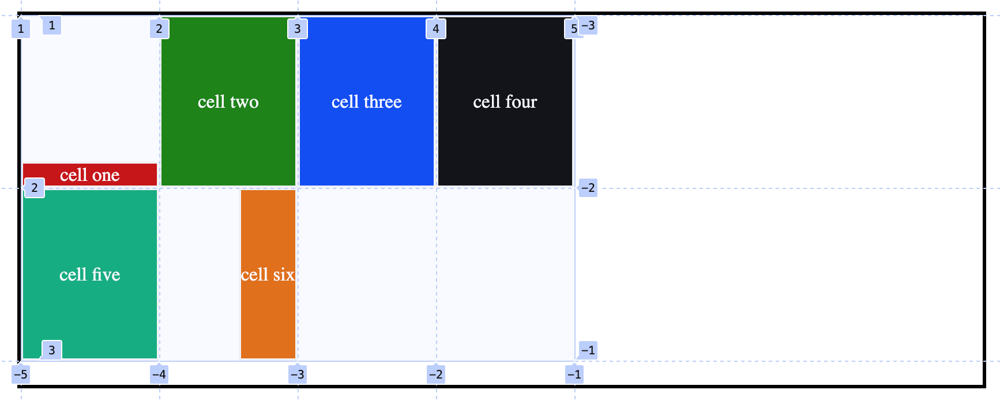

# align-self:

Now, if we want to move individual elements inside a cell in column direction or row direction we will use `align-self` or `justify-self` property.

Like `align-items`, it moves the content along vertical direction of a cell, with one difference that `align-items` will be added to the parent, whereas `align-self` will be added to the individual cells.

All properties are the same as `align-items` or `justify-items`.

Lets say we want the first cell's content to be at the end of vertical axis(cross axis) inside its cell and 6th column's content to be at the end of its cell in horizontal direction(main-axi).

```css
.container {
	display: grid;
	margin: 1rem 0rem 2rem 2rem;
	grid-template-columns: repeat(4, 120px);
	grid-template-rows: repeat(2, 150px);
	justify-items: stretch;
	min-height: 70vh;
	max-width: 50vw;
	min-width: 40vw;
	border: 3px solid rgb(3, 1, 0);
}

.cell-1 {
	background: rgb(199, 0, 0);
	align-self: end;
}

.cell-6 {
	background: rgb(227, 102, 0);
	justify-self: end;
}
```

<figure>

<figcaption><p align="center">align self and justify self added</p><figcaption>
</figure>
