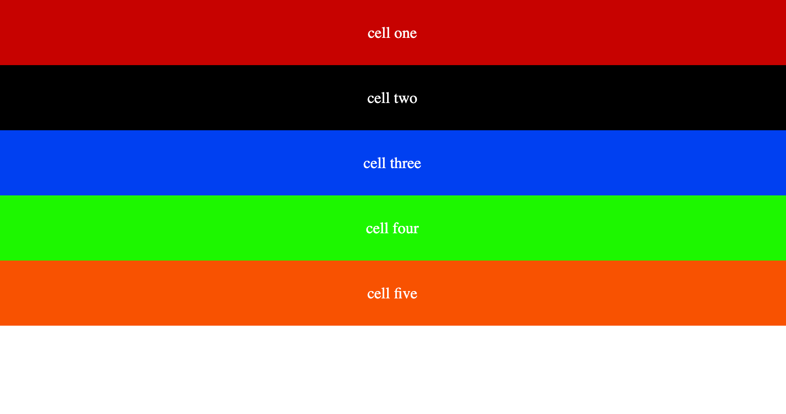

## Layouts:

Using layouts, we can organize how our contents will be displayed. Flex and grid and boxes are all popular CSS layout options.

Layout helps us to organize the relevant content together.

## Grid

CSS grid is a powerful tool that helps us to create two-dimensional layout.

A css grid container can be created by simply adding display: grid property to the css.

<figure>

<figcaption>Grid normal flow</figcaption>
</figure>

This is the CSS code for the above image.

```css
.container {
	border: 2px solid rgb(0, 242, 255);
}

.cell {
	color: white;
	font-size: 1.1rem;
	height: 5rem;
	font-size: 1.2rem;
	display: grid;
	place-items: center;
}
```

If no additional style is added to the container, the elements will appear just as they will do in their default mode.

Different adjustment can be made to each element inside the container.

```css
* {
	margin: 0;
	padding: 0;
	box-sizing: border-box;
}

.container {
	border: 2px solid rgb(0, 242, 255);
}

.cell {
	color: white;
	font-size: 1.1rem;
	height: 5rem;
	font-size: 1.2rem;
	display: grid;
	place-items: center;
}

.cell-1 {
	background: rgb(199, 0, 0);
}

.cell-2 {
	background: rgb(0, 0, 0);
}

.cell-3 {
	background: rgb(0, 64, 241);
}

.cell-4 {
	background: rgb(29, 247, 0);
}

.cell-5 {
	background: rgb(227, 102, 0);
}
```
