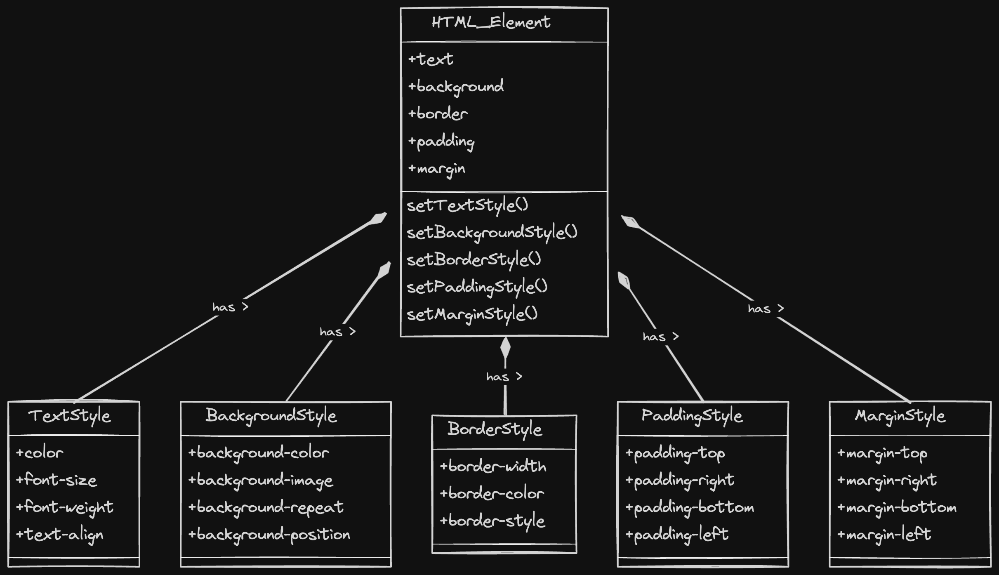

## Cascading Style Sheets (CSS):

It tells browser how to display elements on the screen.

CSS is a style sheet language that is used to describe the look and layout of a web page that is written in HTML.
It gives control over color, size, positioning, fonts, spacing and many more.
It separates the content from style and allow us to change the appearance of a website without changing its structure.

<figure>
    
    <figcaption>CSS properties and HTML element relationships</figcaption>
</figure>