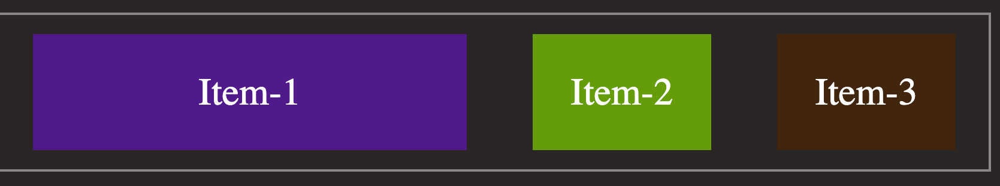

## Flex:

flex box is a type of container that and can easily scale over larger web applications and also it gives more control for controlling the elements inside a container.

The main idea behind the flex layout is to give the container the ability to alter its items’ width/height (and order) to best fill the available space (mostly to accommodate to all kind of display devices and screen sizes). A flex container expands items to fill available free space or shrinks them to prevent overflow.(1)

<a href="https://css-tricks.com/snippets/css/a-guide-to-flexbox/#aa-basics-and-terminology" targe="_blank">image source</a>

Because, The elements inside can grow, shrink unlike the block and inline block elements which does not have much control over the elements inside.

Flex box is a single-dimensional, which we means we can either align it along the vertical or horizontal axis.

When the elements are aligned along the rows, the horizontal-axis is called the main axis and vertical axis is called cross-axis.

If the row is the main axis, the items start from top left and continues until there is no space and starts in a new row once reached to the end of the first row.

<a href="https://css-tricks.com/snippets/css/a-guide-to-flexbox/#aa-basics-and-terminology" targe="_blank">(1)</a>

### Flex Box Properties

