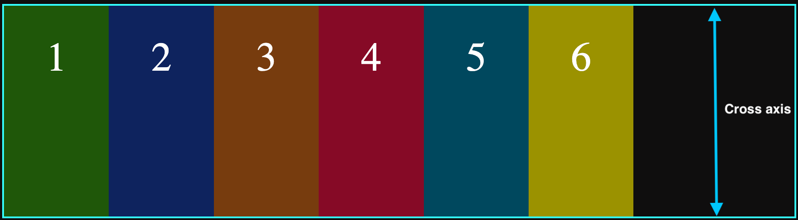
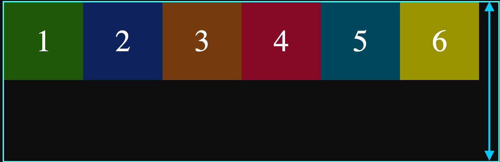
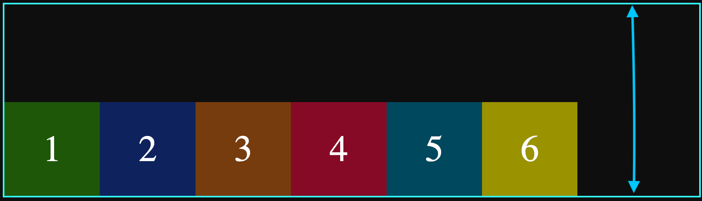
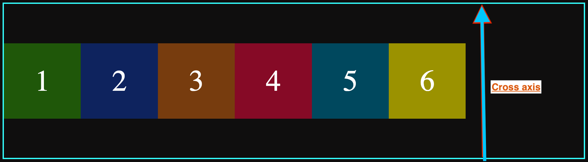
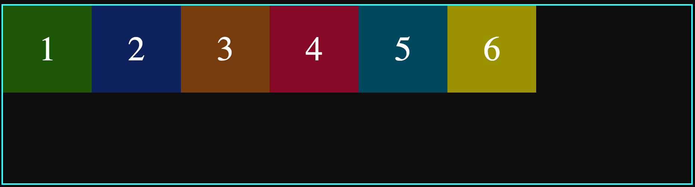

## Align Items:

It describes the behavior of items when they are across cross axis(vertical axis).
The default value is stretch which means it will take the full height of the box or goes all along the cross axis.

To observe its behavior we need to add height to the box.

```css
.container {
	height: 30rem;
	align-items: stretch;
	display: flex;
	align-items: start;
	align-items: center;
	align-items: end;
	border: 2px rgb(50, 255, 255) solid;
}
```

These values can be assigned to align items.

1. `align-items:stretch`: Default behavior, it will take the full height of the container.

<figure>

</figure>
<figure>

1. `align-items:start`: Items are placed at the beginning of cross axis.

<figure>

</figure>
<figure>

`align-items:end`: Items are placed at the end of cross axis.

<figure>

</figure>

`align-items:center`: Items are aligned at the center of cross axis.

<figure>

</figure>

`align-items:basis`: Items are aligned based on their base from bottom which means no matter of height of the item, from base(bottom), all will look aligned in one line. It will helps more when their is text of different size, when this value assigned, all will be in the same line from bottom.

<figure>

</figure>
