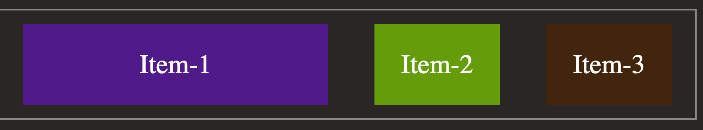
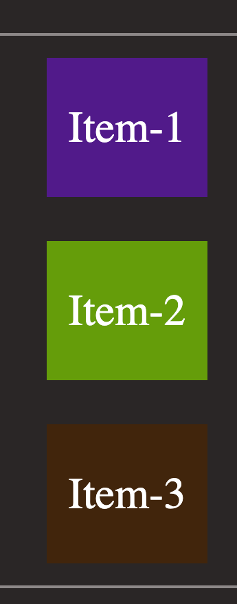
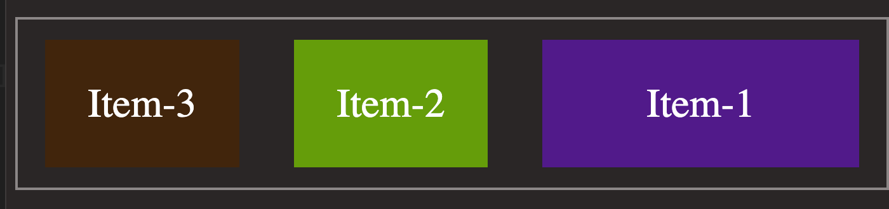
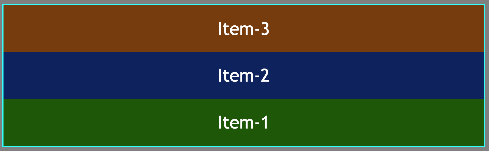

## Flex:

flex box is a type of container that and can easily scale over larger web applications and also it gives more control for controlling the elements inside a container.

The main idea behind the flex layout is to give the container the ability to alter its items’ width/height (and order) to best fill the available space (mostly to accommodate to all kind of display devices and screen sizes). A flex container expands items to fill available free space or shrinks them to prevent overflow.(1)

## 1. flex-direction:

This defines the mains, in another words the way children are going to aligned, either horizontally or vertically.
If it is not mentioned, default value is horizontal from left to right:

Following values can be assigned to `flex-direction` property:

-`row`: default; main axis is horizontal axis from left to right along the main.

  <figure>.
  
  </figure>
- `column`: main axis is cross axis from top to bottom which means the elements will be from top to bottom.
  <figure>
  
  </figure>
- `row-reverse`: elements are aligned from right to left.
  <figure>
  
  </figure>
- `column-reverse`: elements ara aligned from bottom to top.
  <figure>
  
  </figure>
