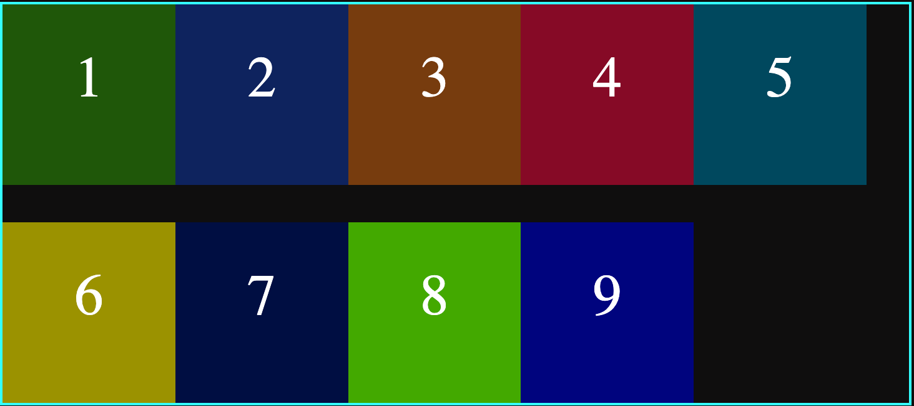
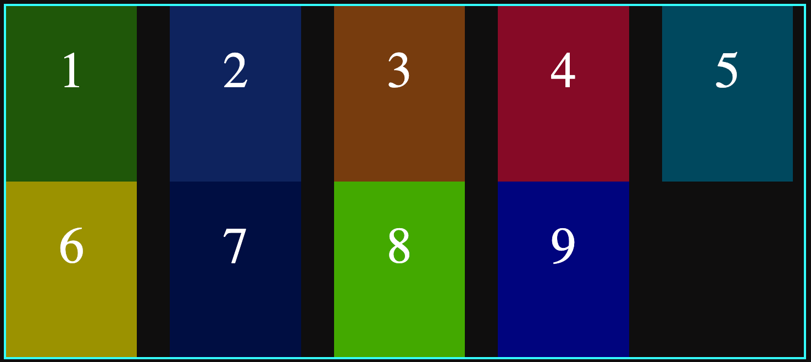
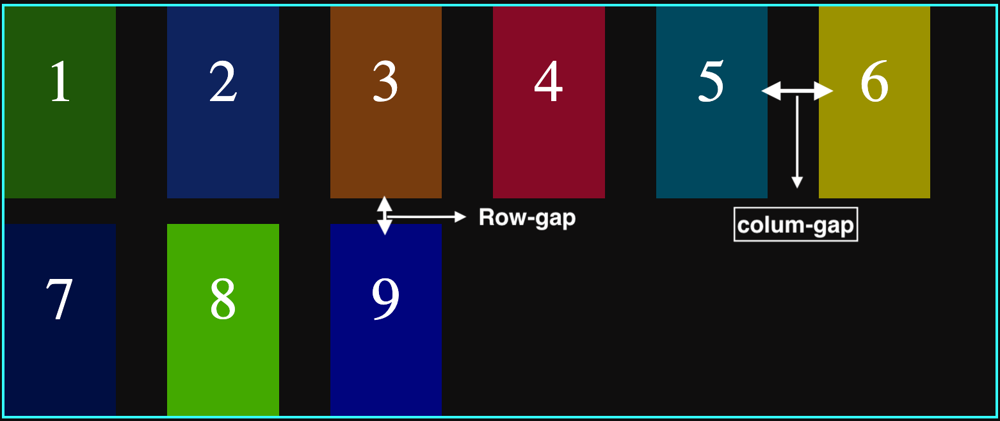
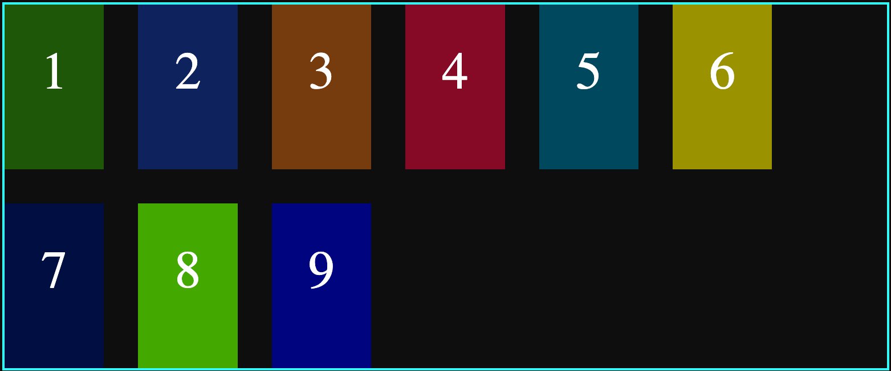

## Gap:

It is used to create spaces between flexible container elements and the spacing is applied only between items, not the outer border.

This property can be added using four ways.
`gap`: It applies the spacing bot for the columns and rows, it short notation for `gap: row-gap column-gap`.

```css
.container {
	height: 20rem;
	display: flex;
	flex-wrap: wrap;
	border: 2px rgb(50, 255, 255) solid;
	gap: 30px;
}
```

`row-gap:30px`: Applies `30px` gap between elements row-wise.

<figure>

</figure>

`colum-gap:30px`: Applies `30px` gap between the columns.

<figure>

</figure>

`gap: 20px 40px`: Applies `20px` row gap and `40px` column gap.

<figure>

</figure>
 
`gap:30px`: Applies `30px` gap row-wise and column-wise between the container elements.

<figure>

</figure>
