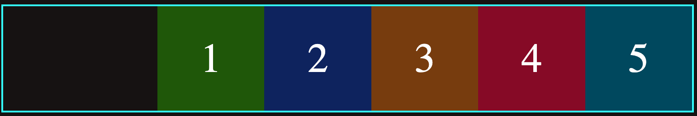
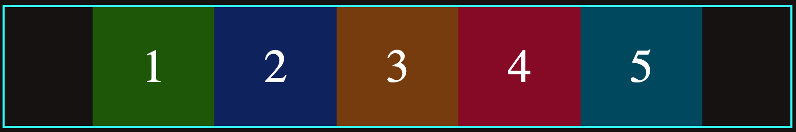
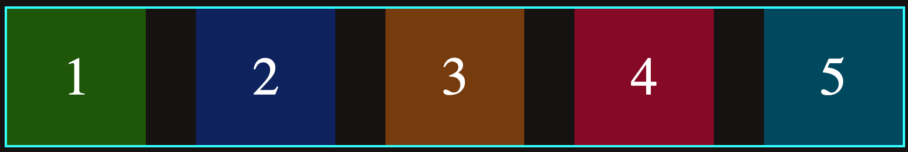
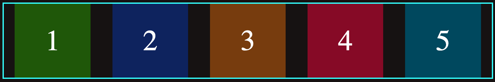

# Justify Content:

Using this property, container items can be aligned along the main axis. It helps to distribute the left over free spaces when either all of the elements are inflexible or flexible but have reached their maximum size.

It can take the following values:

-`flex-start`: Items are placed at the beginning of the container.

<figure>

</figure>.

-`flex-end`: Items are aligned at the end of the container.

<figure>

</figure>.

-`center`: Items are placed at the center of the container.

<figure>

</figure>.

-`space-between`: Items are placed in such a way that spaces between them are equal, except the first and last element that one of their sides ar attached to the container border.

<figure>

</figure>.

-`space around`: Items are placed in a way that the spaces between them are equal except the first and last element where the spaces or one unit on the left and right side between the item and container wall.

 <figure>

</figure>.
 
 -`space-evenly`: Items are placed in such a way that spaces between any of the element are equal.

 <figure>

</figure>.
