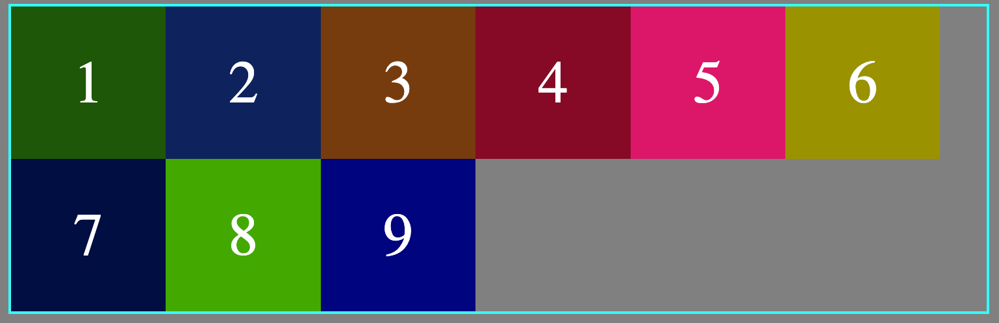
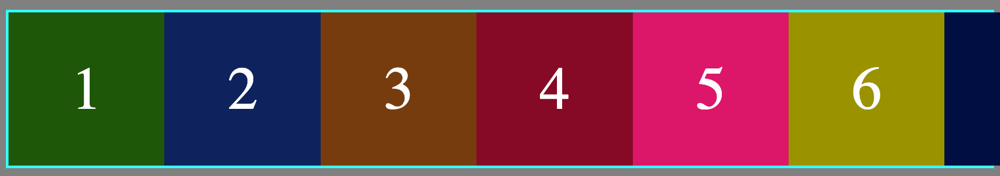
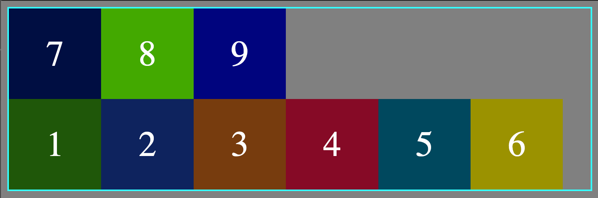

# flex-wrap:

By default flex items tries to stay and fit in one line, but it this property can be changes by using different values for `flex-wrap` property.

```css
.container {
	display: flex;
	flex-wrap: wrap | nowrap | wrap-reverse;
}
```

`nowrap` causes overflow which means some of the contents cannot be seen and will move out of normal flow.

Following values can be assigned to `flex-direction` property:

-`wrap`: Wraps the elements across multiple lines after certain point.

  <figure>
  
  </figure>

-`nowrap`: Default value and fits all the element across main axis, but causes overflow.

  <figure>
  
  </figure>
-`wrap-reverse`: Wraps the element from bottom to top.
  <figure>
  
  </figure>
