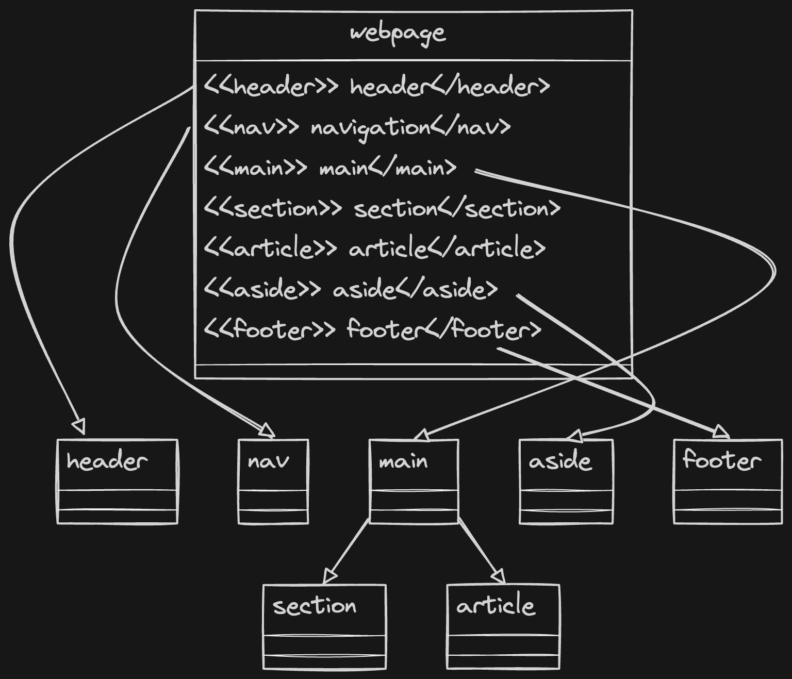

### Semantics:
It is best practice when writing an html code to describe the content using something that has meaning.
For instance, if you are trying to add headings, do not use `<p>` and increase its font size;Use headings tags instead to convey to the search engine and screen readers that it is a heading.
Each html tags are there to server a purpose.
`` for image, `<ul>` for un-order list and so on.

The idea is simple, describe your content semantically to add meaning using proper elements so that search engines can easily understand our content.

#### Basic Structure:

```html
<html lang="en">
    
<head>
</head>
<body>
</body>

</html>
```

#### Basic Layout

```html
<html lang="en">
<head>
    <meta charset="UTF-8">
    <meta name="viewport" content="width=device-width, initial-scale=1.0">
    <title>Document</title>
</head>
<body>
    <!-- Logo, Navbar -->
    <header>

    </header>
    <!-- Main contents -->
    <main>

    </main>
    <!-- Additional links -->
    <footer>

    </footer>
</body>
</html>

```

## 1. Navbar:
The main navigation links of your website should be added inside the nav element.


```html
<!DOCTYPE html>
<html lang="en">
<head>
    <meta charset="UTF-8">
    <meta name="viewport" content="width=device-width, initial-scale=1.0">
    <title>Document</title>
</head>
<body>
    <!-- Logo, Navbar -->
    <header>
    <nav>
        <ul>
            <li><a href="#home">home</a></li>
            <li><a href="#courses">courses</a></li>
            <li><a href="#contact">contact</a></li>
        </ul>
    </nav>
    </header>
    <!-- Main contents -->
    <main>
    </main>
    <!-- Additional links -->
    <footer>
    </footer>
</body>
</html>


```
## 2. Main
For header, usually we have the logo and after the logo, we have nav links.
For main section, we have `<article>` and `<section>`

`1. <article>`: It represents a complete and self contained composition in a document page application. Just like a newspaper.

It represent an independent content, Examples are Forum post, article, blog post, user comment and so on.

```html
body>
    <!-- Logo, Navbar -->
    <header>
    </header>
    <!-- Main contents -->
    <main>
        <article>
            <h2>My Story</h2>
            <p>I want to change the world and only the paranoid survives.</p>
        </article>
    </main>
    <!-- Additional links -->
    <footer>
    </footer>
</body>

```

`2. <section>`: It defines the individual section of the article.
`<section>` should contain heading elements to semantically describe the section.

```html
<!DOCTYPE html>
<html lang="en">
<head>
    <meta charset="UTF-8">
    <meta name="viewport" content="width=device-width, initial-scale=1.0">
    <title>Document</title>
</head>
<body>
    <!-- Logo, Navbar -->
    <header>
    <nav>
    </nav>
    </header>
    <!-- Main contents -->
    <main>
        <article>
            <h1>Hooshmandlab Journey</h1>
            <section>
                <h1>Early life</h1>
                <p>It all started with one simple idea, help others to grow.</p>
            </section>
            <section>
                <h1>Mid life</h1>
                <p>Not easy to survive, but vision was broad and narrow at the same time.</p>
            </section>
        </article>
    </main>
    <!-- Additional links -->
    <footer>
    </footer>
</body>
</html>
```


`<aside>`: A secondary set of content that is not required to understand the main content.

## 3. Footer
It contains additional links and content to the website.
```html
<html lang="en">
<head>
    <meta charset="UTF-8">
    <meta name="viewport" content="width=device-width, initial-scale=1.0">
    <title>Document</title>
</head>
<body>
    <!-- Logo, Navbar -->
    <header>
    </header>
    <!-- Main contents -->
    <main>
    </main>
    <!-- Additional links -->
<footer>
    <div class="footer-content">
        <p>&copy; 2024 Your Company Name. All rights reserved.</p>
        <p>Your Company Address</p>
        <p>Your Contact Information</p>
    </div>
</footer>
</body>
</html>

```


</img>
<figcaption>Layout of a simple website.</figcaption>

## More semantic elements:

### Headings:

`<h1><h2><h3><h4><h5><h6>`: Headings on the web page. <h1> indicates the most important heading whereas <h6> indicates the least important, use them in order.

## Content:
`<figcaption>`: Defines a caption for a photo image.

`<figure>`: Applies markup to a photo image.

## Inline Tags:

`<a>`: An anchor link to another HTML document.

`<abbr>`: Specifies that the containing text is an abbreviation or acronym.


`<br>`: A line break. Moves the subsequent text to a new line.

`<code>`: Indicates that the containing text is a block of computer code.

`<data>`: Indicates machine-readable data.

`<mark>`: The containing text should be marked or highlighted.

`<span>`: A generic element for grouping content for CSS styling.

```bash
      <cite>hello</cite>
        <code>def code</code>
        <var>x = 3*4</var>
        <datalist>helllo</datalist>
        <p><mark>hello</mark></p>
        <strong>hello</strong>
        <em>hello</em>
        <sub>king</sub>
```


## Embedded content and media tags:

`<audio>`: Used to embed audio in web pages.

`<canvas>`: Used to render 2D and 3D graphics on web pages.

<code>
<embed>
Used as a containing element for external content provided by an external application such as a media player or plug-in application. 

<iframe>
Used to embed a nested web page. 


Embeds an image on a web page.

<object>: Similar to <embed> but the content is provided by a web browser plug-in.

<picture> : An element that contains one  element and one or more <source> elements to offer alternative images for different displays/devices.

<video> : Embeds a video on a web page.

<source>: Specifies media resources for <picture>, <audio> and<video> elements.

<svg>: Used to define Scalable Vector Graphics within a web page.


</code>

## Table:

<code>

<table>
Defines a table element to display table data within a web page.

<thead>
Represents the header content of a table. Typically contains one <tr> element.

<tbody>
Represents the main content of a table. Contains one or more <tr>elements.

<tfoot>
Represents the footer content of a table. Typically contains one <tr> element.

<tr>
Represents a row in a table. Contains one or more <td> elements when used within <tbody> or <tfoot>. When used within <thead>, contains one or more <th> elements.

<td>
Represents a cell in a table. Contains the text content of the cell.

<th>
Defines a header cell of a table. Contains the text content of the header.

<caption>
Defines the caption of a table element.
</code>

```bash
<table>
    <thead>
        <tr>
            <th>Name</th>
            <th>Age</th>
            <th>Country</th>
        </tr>
    </thead>
    <tbody>
        <tr>
            <td>Ahmad</td>
            <td>43</td>
            <td>Afg</td>
        </tr>
        <tr>
            <td>Yama</td>
            <td>25</td>
            <td>India</td>
        </tr>
    </tbody>
</table>

```