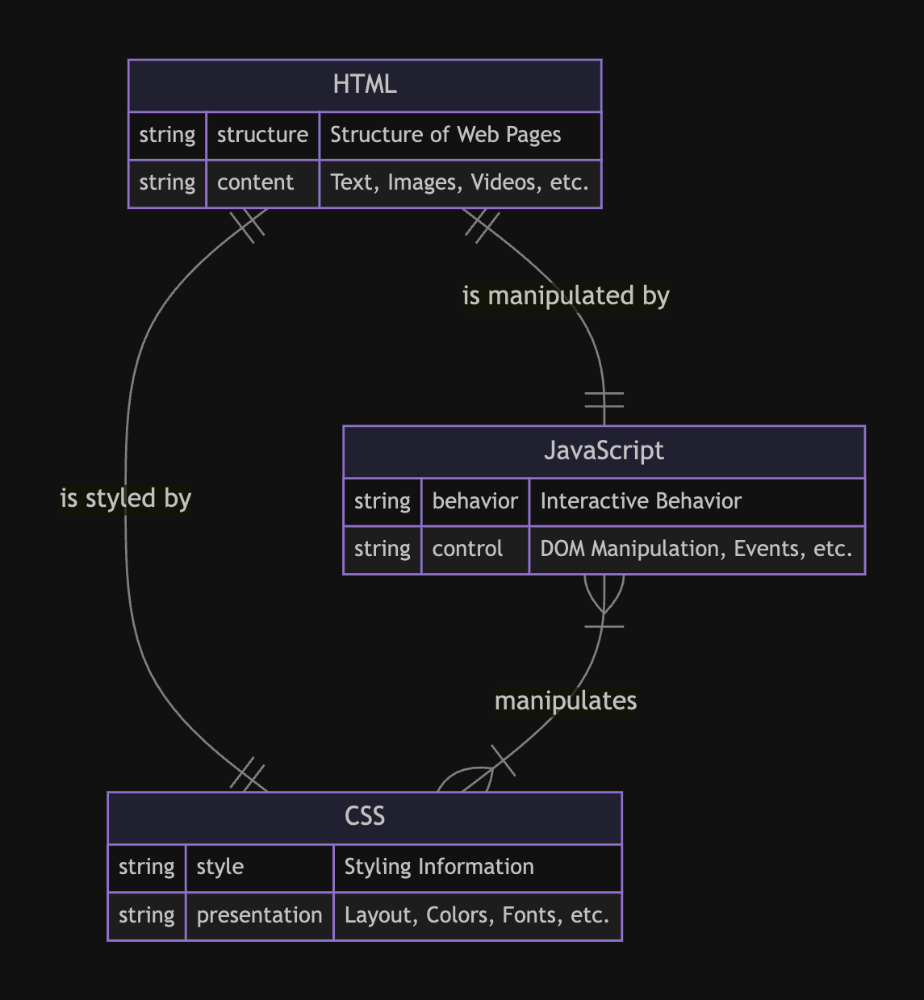
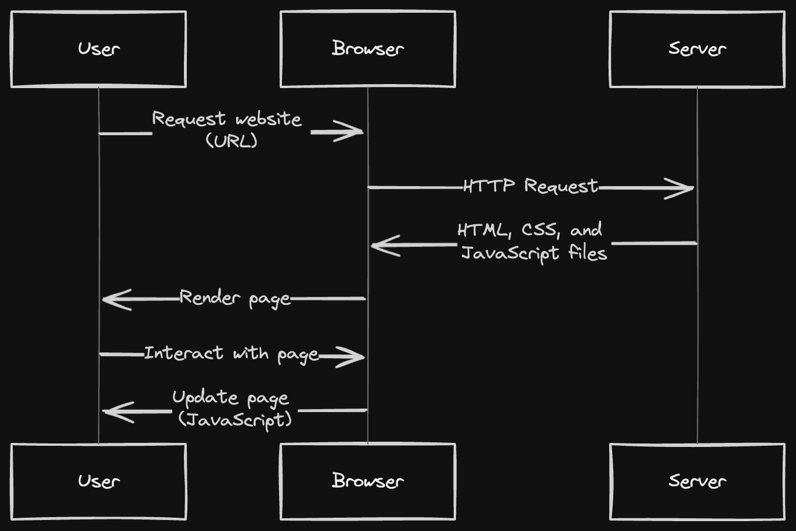

### Introduction to HTML and CSS

Welcome to the HTML and CSS Resources repository, a curated collection of materials aimed at helping you master the essentials of web development! Whether you're just starting out on your coding journey or looking to expand your existing skills, you'll find a wealth of valuable resources here



## Table of Contents

- [Table of Contents](#table-of-contents)
- [Introduction](#introduction)
- [Contents](#contents)
- [Usage](#usage)

## Introduction

This repository serves as a learning resource for CSS enthusiasts, developers, and learners. Whether you're new to CSS or looking to level up your skills, you'll find a variety of examples and demonstrations to help you understand and implement various CSS concepts.

## Contents

| File Name              | Description                                         |
| ---------------------- | --------------------------------------------------- |
| align-minmax()         | Demonstrates the `align-minmax()` CSS function.     |
| backgroundImage        | Example of using background images in CSS.          |
| box                    | CSS techniques related to box styling.              |
| colors                 | Various CSS color manipulation techniques.          |
| css-animation          | Demonstrates CSS animations.                        |
| css-before-after       | Utilizing `::before` and `::after` pseudo-elements. |
| css-fit-in             | Techniques for fitting elements in CSS.             |
| css-flex-basis         | Using `flex-basis` property in flexbox layouts.     |
| css-flex-logo          | Demonstrates flexbox layout for logos.              |
| css-flex-wrap          | Demonstrates wrapping behavior in flexbox layouts.  |
| css-flexbox            | CSS flexbox layout techniques.                      |
| css-media-queries      | Utilizing media queries in CSS.                     |
| css-positioning        | CSS positioning techniques.                         |
| css-z-index            | CSS `z-index` property usage.                       |
| css_BOX                | Various CSS box model techniques.                   |
| css_Display            | Different CSS display property values.              |
| css_Navbar             | CSS techniques for creating navigation bars.        |
| css_color              | Tips and tricks for working with CSS colors.        |
| css_font               | CSS font styling techniques.                        |
| css_id                 | Usage of CSS ID selectors.                          |
| css_parent_selector    | Demonstrates CSS parent selectors.                  |
| css_trick              | General CSS tricks and tips.                        |
| css_units              | Understanding and using CSS measurement units.      |
| floats                 | CSS float property usage.                           |
| forms                  | CSS techniques for styling HTML forms.              |
| grid-area-justifyalign | CSS grid layout techniques.                         |
| grid-area              | CSS grid layout techniques.                         |
| grid-autofill-auto-fit | CSS grid autofill and auto-fit techniques.          |
| grid-cloumn-fr-gap     | CSS grid techniques.                                |
| grid-lines             | Understanding CSS grid lines.                       |
| grid-naming            | Naming grid lines in CSS grid layouts.              |
| hoshmand-lab-html      | HTML-related techniques from hoshmand-lab.          |
| images                 | Techniques for working with images in CSS.          |
| positions              | CSS positioning techniques.                         |
| project-0              | CSS techniques for specific projects.               |
| units                  | Understanding and using CSS measurement units.      |
| z-index                | CSS z-index property usage.                         |



Feel free to explore each file to learn more about the specific CSS technique or trick it demonstrates.

## Usage

You can use these files by simply downloading or cloning the repository to your local machine:

```bash
git clone https://github.com/your-username/css-tricks-and-tips.git
```
