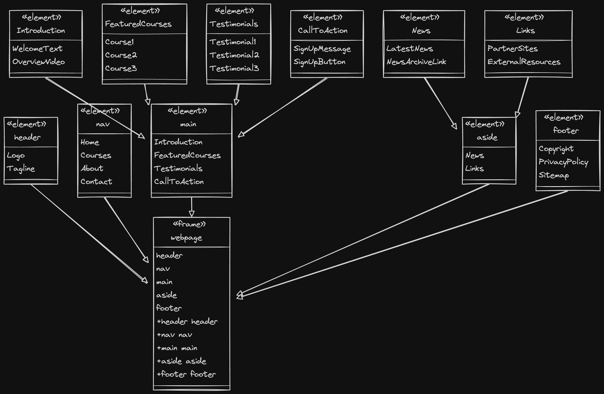

## Open Graph Protocol(OG):

It consist of sets of metadata rules for describing the website when shared on social media platforms.
It helps the social media platform to create a preview of the shared web page.

Introduced in 2010 by Meta.

The rules are almost same as metadata, but instead of `name` attribute, it uses `property` and the `content` remains the same.

```html
<head>
	<meta name="author" content="Ahmad" />
	<meta property="og:title" content="My web page about science." />
</head>
```

We need to include at least four different protocols, `og:title`,`og:type`,`og:url`,`og:image`.

```html
<head>
	<meta name="author" content="Ahmad" />
	<!-- the title that we want to be shared -->
	<meta property="og:title" content="My web page about science." />
	<!-- type can be music, video, article,... -->
	<meta property="og:type" content="website" />
	<!-- the url that will appear in the card -->
	<meta property="og:url" content="https://www.hooshmandlab.com" />
	<!-- the image that will be shared on the screen -->
	<meta property="og:image" content="https://hooshmandlab.com/pages/courses" />
	<!-- A brief note that will be shown -->
	<meta
		property="og:description"
		content="A free educational platform where students from afghanistan can use to learn about the world of computation." />
	<!-- The language of the website and its locale -->
	<meta property="og:locale" content="en_US" />
	<meta property="og:site_name" content="HooshmandLab" />
</head>
```

   <figure style="margin: 0 auto; max-width: 600px; text-align: center;">
        
        <figcaption style="padding-top: 10px; text-align:center;">Open graph protocol and its properties</figcaption>
    </figure>

<a src="https://www.freecodecamp.org/news/what-is-open-graph-and-how-can-i-use-it-for-my-website/">
